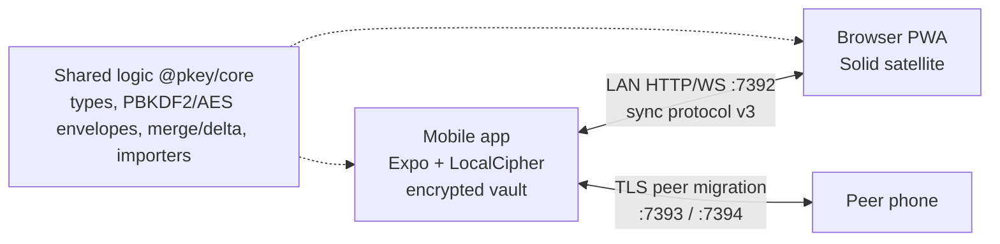
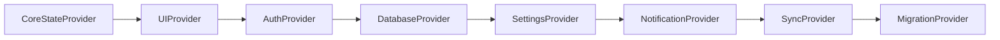
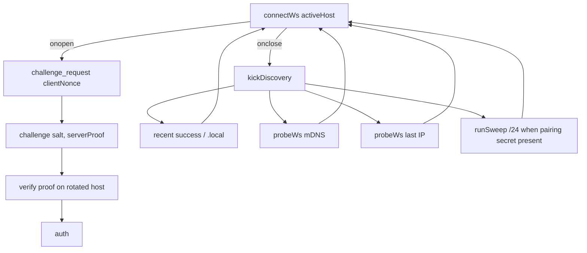

# Architecture

Technical overview of the PKEY monorepo: packages, data flow, encryption, and stack. Details for individual packages live in companion docs linked below. Historical notes (pre-public-release) are in [`archive/`](../archive/).

## Stack

| Layer | Technology |
|-------|------------|
| Mobile app | Expo SDK **56**, React Native **0.85**, React **19**, TypeScript; dashboard tabs via React Navigation Native Bottom Tabs (`react-native-screens`) |
| Shared domain | `@pkey/core` (pure TypeScript, no RN/Expo) |
| Web PWA | Solid.js + Vite (single-file HTML) |
| Native (Android / iOS) | Expo modules `pkey-web-access`, `pkey-crypto` (Argon2id), `pkey-vault-keys`, `pkey-autofill` |
| Crypto libraries | `crypto-es`, `@noble/hashes`, `@noble/ciphers`, `@noble/curves`; mobile injects native PBKDF2; `pkey-crypto` Argon2id after RFC 9106 KAT (Android BouncyCastle KDF+AEAD once XChaCha matches noble; iOS phc-winner-argon2 KDF + JS AEAD) |
| LAN networking | `react-native-tcp-socket`, `react-native-zeroconf` |
| Tests | Jest (mobile), Vitest (core + web), Playwright (web e2e) |

## Monorepo layout

```text
pkey/
├── App.tsx                 # Expo entry shell
├── src/                    # Mobile app (screens, services, context)
├── packages/
│   ├── core/               # @pkey/core — crypto, vault, sync, importers
│   └── web-client/         # Solid + Vite PWA
├── modules/
│   └── pkey-web-access/    # Web-access keep-alive Expo module (Android + iOS)
├── scripts/                # APK, embed PWA, fixtures, OTP checks
├── docs/                   # Active documentation (this folder)
├── archive/                # Obsolete engineering notes
└── .github/workflows/      # CI
```

| Area | Doc |
|------|-----|
| Mobile app (`src/`) | [MOBILE_APP.md](./MOBILE_APP.md) |
| `@pkey/core` | [CORE_PACKAGE.md](./CORE_PACKAGE.md) |
| Web client | [WEB_CLIENT.md](./WEB_CLIENT.md) |
| Native module | [NATIVE_MODULE_WEB_ACCESS.md](./NATIVE_MODULE_WEB_ACCESS.md) |
| Build scripts | [SCRIPTS.md](./SCRIPTS.md) |

## Data flow (high level)



1. **Unlock:** Master password → **one** native Argon2id (64 MiB, t=3, p=1 on current vaults / v4; PBKDF2 600k/100k remain legacy unlock paths) → AEAD open → session handle. Production does not fall back to JS Argon2id 64 MiB. Optional biometric unlock reads the derived root from `pkey-vault-keys` (TEE/StrongBox / Keychain), not the master password. Optional device secret HKDF-mixes the encryption root (`bindDeviceSecret`); a copied `.pkey` then needs the recovery kit on another device.
2. **At rest:** Encrypted vault file in app documents (envelope v4: XChaCha20-Poly1305 with AAD). Cards are sanitized for UI; secrets live in `SecretStore` until revealed.
3. **LAN web access:** Phone serves embedded PWA + WebSocket sync on port **7392**. Auth is SPAKE2 (protocol v3) keyed by the password hash, with HMAC challenge-response as grace for protocol v2. After a successful login the phone delivers a random **host pairing secret** inside encrypted `auth_ok`; later discovery verifies `computeHostProof` under that secret. Protocol v3 uses XChaCha20-Poly1305 wire envelopes; v2 remains AES-CBC+HMAC. The Security tab can show LAN kind, IPv4, and optional Wi‑Fi SSID. See [Web access auto-recovery](#web-access-auto-recovery).
4. **Device migration:** Receiver listens on **7393**; sender uses callback **7394**. Transfer is TLS; pairing code is not broadcast on mDNS.
5. **Import:** Third-party exports go through `@pkey/core` detect → parse → map → dedupe, shared by mobile and web wizards.

## Encryption (summary)

| Concern | Approach |
|---------|----------|
| Auth / KDF | Argon2id (RFC 9106) on current vaults; PBKDF2-SHA256 600k (`v3-hkdf`) and 100k (`v2-pbkdf2`) for legacy unlock |
| Vault at rest (v4) | XChaCha20-Poly1305 with AAD over the public header; optional device-secret HKDF mix (`deviceBound`). The recovery kit is the portable Crockford copy of that secret (mobile `deviceSecret.ts`); it is not stored in the envelope. |
| Sync wire (v3) | XChaCha20-Poly1305 envelopes `{ v, nonce, ciphertext }`; SPAKE2 login |
| Sync wire (v2 grace) | AES-CBC + HMAC-SHA256 envelopes `{ salt, iv, ciphertext, hmac }` |
| OTP | TOTP (RFC 6238) / HOTP (RFC 4226); `otpSecret` excluded from display models |
| Migration | TLS between peers; payload integrity via SHA-256 of transferred blobs |
| PWA CSP | Per-request nonces injected when serving embedded HTML |

Core must stay free of `react-native` / `expo-*` imports (`npm run check:core-purity`). Mobile may install a faster byte-compatible PBKDF2 provider with `setPbkdf2Provider`.

## Ports

| Service | Port | Constant / notes |
|---------|------|------------------|
| Web sync / PWA | 7392 | `WEB_SYNC_PORT` |
| Migration receiver | 7393 | `MIGRATION_PORT` |
| Migration sender callback | 7394 | |

## Provider nesting (mobile)



## Web access auto-recovery

The PWA never `location.replace`s to a new IP. IndexedDB (`offlineVault`) and
localStorage (`outbox`, `@pkey/server-identity`) are origin-scoped; changing
origin would drop the user's local edits.



### `GET /pkey/meta` (same-origin)

JSON identity document, not a credential. No CORS, no `OPTIONS`, no nonce.

| Field | Meaning |
|---|---|
| `metaVersion` | Schema (`1`) |
| `deviceId` | Stable per-install master id (not the vault generation) |
| `mdnsHost` | Published `.local` name, or `''` |
| `ip` | Current LAN IPv4, or `''` |
| `generatedAt` | Epoch ms |

The vault **salt** is not in `/pkey/meta`. It arrives on the auth `challenge`. The PWA pins salt on `auth_ok`. A new install gets a new `deviceId`; a new session gets a new salt even with the same password. Salt mismatch + local PWA cards → `vault_fork` chooser on the phone (one session replaces the other). Deferring does not LWW-merge; the pause is durable until the user picks a side.

CSP on the PWA shell is `connect-src 'self' ws:`: meta is `'self'`; discovery
opens `ws://<candidate>:7392/pkey/ws` (already allowed by `isAllowedWsOrigin`
for private and `.local` origins). There is no `/pkey/ping`.

### Mutual proof

`computeHostProof(clientNonce, hostProofSecret) = HMAC-SHA256(secret, "pkey-host-proof\|" + nonce)`.

The pairing secret is random 32 bytes, stored on the phone in SecureStore and
on the PWA under `@pkey/server-identity` after the first encrypted `auth_ok`.
It is **not** derived from the master password. Pre-auth `challenge` replies
may include `serverProof` plus `proofKind: host-pairing`; that HMAC is not an
offline oracle for the vault verifier. The password HMAC (`computeChallengeResponse`)
is sent only in `auth`, which counts toward the 3-failures / 15-min limiter.

The domain prefix keeps the host proof from being reusable as a challenge
response. The PWA pins `salt` on the first `auth_ok` (against the page origin used to
open the vault) and refuses a rotated host whose salt or pairing proof does not match.
Residual risk is a pure relay MITM — the same class of attacker who can already
sit on the LAN HTTP/WS today. Same-URL reconnects with a **new** salt (new
phone session) do not fail auth when the password matches; they pause sync and
ask which vault to keep instead of silently pinning the empty/new master.

A durable replacement is a PAKE (OPAQUE / SPAKE2+ / SRP) so neither side sees
a crackable MAC. Protocol v3 uses SPAKE2 over P-256; HMAC challenge-response
remains only as grace for protocol v2 peers.

`discovery` (`idle` \| `active` \| `found`) is a UI flag, not a `ConnState`:
the vault stays editable offline while the hunt runs. A background meta
refresh is ignored while a live authenticated socket is open
(`shouldApplyMeta`).

**Known limitation — cold start:** opening or reloading the PWA at a dead numeric
address does not recover (no service worker; HTTP origins cannot register one).
Recovery: on the phone, tap Copy address and paste in a **new** browser tab.
Do not reload an old favorite that used numbers. A `.local` favorite can keep
working when the name still resolves (macOS, iOS, Linux; Windows often needs
the Copy address fallback).

Copy/QR prefer the published `.local` URL. The numeric address is a fallback
when the name does not open (typical on some Windows browsers).

## Related validation

- [SECURITY_HARDENING_VALIDATION.md](./SECURITY_HARDENING_VALIDATION.md)
- [MIGRATION_TLS_VALIDATION.md](./MIGRATION_TLS_VALIDATION.md)
- [WEB_MDNS_VALIDATION.md](./WEB_MDNS_VALIDATION.md)
- [PERFORMANCE.md](./PERFORMANCE.md)
- Historical session notes: [archive/SESSION_SECURITY_EXPLANATION.md](../archive/SESSION_SECURITY_EXPLANATION.md)
