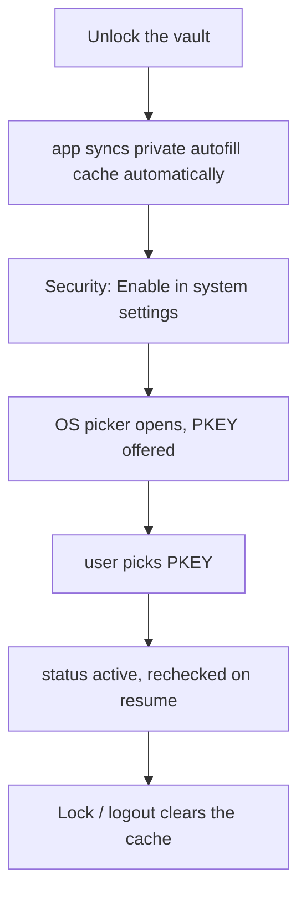

# System autofill

PKEY can fill logins in other apps via the **OS password provider** APIs.

## Platform reality

Neither Android nor iOS lets an app silently become the system autofill provider.
The user must confirm in system Settings.

| Platform | Status |
|----------|--------|
| **Android** | `AutofillService` in `pkey-autofill`. App opens the system picker (`ACTION_REQUEST_SET_AUTOFILL_SERVICE`) and detects if PKEY is already selected. |
| **iOS** | Needs an AutoFill Credential Provider extension + entitlements. **Not shipped yet.** Search-by-URL ranking still works in the vault. |

## Matching

Candidates are ranked from vault `link` **and** optional `uris` (Google `android://…@package`, Bitwarden `androidapp://package`, https hosts). Android AutofillService matches the requesting **package name** and/or web domain. iOS Credential Provider (not shipped) should index the same **https hosts**.

## Android flow

Requires a **dev-client / release build** with `pkey-autofill` (not Expo Go).

## Out of scope (for now)

- iOS Credential Provider
- Browser extensions
- Saving new logins from the system “save password” prompt
