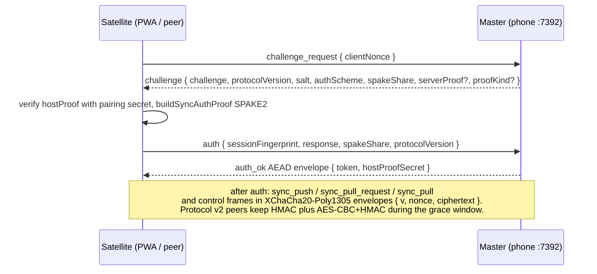
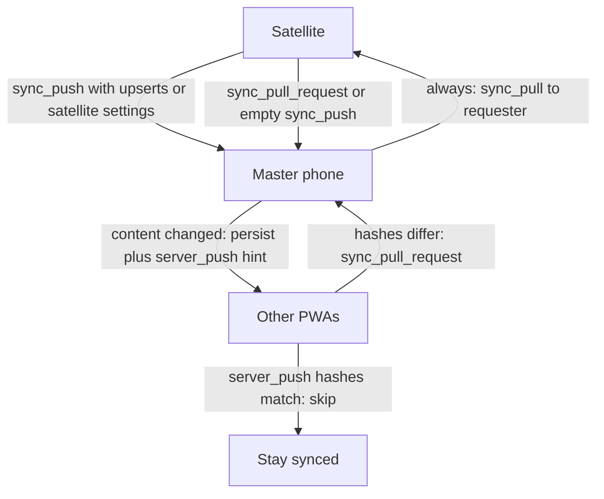
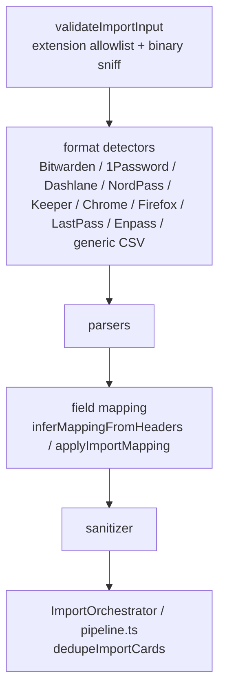

# `@pkey/core` — Shared Domain Library

Platform-agnostic TypeScript package shared by the Expo mobile app and the Solid.js web client. Owns encryption helpers, vault utilities, LAN sync protocol logic, third-party import pipelines, web i18n strings, and vault statistics.

**Constraint:** no `react-native` or `expo-*` imports (enforced by `npm run check:core-purity`).

> Workspace package `"@pkey/core": "1.0.0"`. Prefer `import { … } from '@pkey/core'` over deep paths. License: [LICENSE](../LICENSE) (audit-only).

## Layout

```text
packages/core/src/
├── index.ts           Public barrel
├── types/             PasswordCard, AppSettings, SyncIndex, EncryptedDatabase, …
├── crypto/            Argon2id + XChaCha20-Poly1305 (v4), PBKDF2 auth, AES-CBC+HMAC (v2 wire), TOTP/HOTP
├── vault/             SecretStore, password generator, icon detection
├── sync/              Protocol, auth-client, merge, delta, encryptedChannel
├── importers/         Detect → parse → map → dedupe
├── exporters/         CSV + generic JSON (plaintext escape hatch)
├── autofill/          Domain / package login matching + list group-by-host helpers
├── links/             URI parse, canonical `link` + `uris`, Android/iOS identities
├── i18n/web.ts        PWA strings (ESP/ING)
├── statistics.ts      Vault health metrics
├── constants/         Field limits, preset icons
└── util/              Tags, theme, compress, secure random, web utils
```

## Crypto

- Vault envelope v4: Argon2id + XChaCha20-Poly1305 (`envelopeV4.ts`); optional `deviceBound` flag. The hardware secret and recovery-kit encoding live on mobile (`src/services/deviceSecret.ts`); core only exposes `HKDF_INFO_DEVICE_BIND`.
- Sync envelope v3: `{ v, nonce, ciphertext }` (XChaCha20-Poly1305)
- Sync envelope v2 grace: `{ salt, iv, ciphertext, hmac }` (AES-CBC + HMAC-SHA256)
- Auth: Argon2id on current vaults (`v4-argon2`); PBKDF2-SHA256 **600,000** (`v3-hkdf`) and **100,000** (`v2-pbkdf2`) remain legacy unlock paths
- Pluggable KDF/AEAD via `setArgon2Provider` / `setAeadProvider` / `setPbkdf2Provider` (tests/PWA). Mobile password unlock does **not** wire `setArgon2Provider`; it uses async `pkey-crypto.deriveRootKey` once per attempt. Android native AEAD is gated on the noble XChaCha vector; iOS AEAD stays in this package.
- TOTP/HOTP + `otpauth://` URI parse in `crypto/totp.ts`

Highlights: `sha256`, `deriveAuthHash`, `derivePasswordHash`, `encryptSyncPayload`, `generateTotp`, `parseOtpAuthUri`, `constantTimeEquals`.

## Vault

- `SecretStore` — hold passwords / OTP secrets off the display model; reveal timers (default 30s)
- `sanitizeCardForDisplay` — strips secrets; `otpSecret` excluded from display models
- `generateRandomPassword` from `AppSettings` character pools
- `detectIcon` — verified favicon when opted in, then host-brand preset, then fuzzy title, then default
- `sortCardsForList` / `compareCardsForList` — presentation-only vault list order (`title` A–Z with title→URL→username fallbacks; `updated` newest `last_update` first)

## Sync

`SYNC_PROTOCOL_VERSION = 3`. Transport is **not** in core (sockets live in the app or browser).

| Module | Role |
|--------|------|
| `protocol.ts` | Auth + push/pull types |
| `auth-client.ts` | `computeChallengeResponse`, `buildSyncAuthProof`, `computeHostProof` |
| `spake2.ts` | P-256 SPAKE2 for protocol v3 login |
| `encryptedChannel.ts` | Encrypt/decrypt auth-ok, sync-push, and post-auth **control** wire (`encryptControlWire`) |
| `merge.ts` | Card + tombstone merge |
| `delta.ts` | Fingerprints, sync index, outgoing delta, version hash, `vaultContentChanged` |

`usesEncryptedSyncWire(v)` is true for `v >= 2`. `usesAeadSyncWire(v)` is true for `v >= 3`.

### Sync auth handshake (protocol v3)





`SYNC_PROTOCOL_VERSION` is **3**. `sync_pull_request` and `server_push` `{ versionHash, settingsHash }` are additive. An older PWA may still send an empty `sync_push` as a pull; the master treats it as a no-op write. HMAC login remains accepted when the satellite omits `spakeShare` (protocol v2 grace).

## Autofill / link grouping

Identity parsing lives in `links/` (`parseLinkIdentity`, `collectIdentities`, `buildCardLinkFields`).

- `link` is the canonical visible URL (`https://host` when known, else `android-app://package`). `pickCanonicalLink` never returns Google `android://hash@pkg/` when a package parses.
- **`uris?`** holds extra originals (Google `android://hash@pkg/`, Bitwarden `androidapp://…`). Matching uses both.
- `resolveOpenableUrl(link, uris)` — first `http(s)/mailto/tel` safe for `window.open` (PWA).
- `matchLoginCandidates`, `hostFromLink`, `registrableDomain` — rank logins for a URL or Android package (autofill + search).
- `linkGroupKey`, `linkGroupLabel`, `groupCardsByLinkKey` — Bitwarden-style **host** keys for the optional vault list UI (`AppSettings.groupCardsByLink`). Ignores scheme/`www.`/path/query; keeps non-default ports; Android packages use `pkg:…`. Derived package→host maps are **not** used for grouping. Empty links never group. List grouping does **not** use registrable/base-domain merging.

## Vault settings merge

`mergeVaultSettings` shallow-merges satellite settings onto the master vault. `theme` / `language` are the **phone** UI. Optional `webTheme` / `webLanguage` are the **PWA** UI (`webAutoLogout` is the same split). Omitted `web*` fields keep the local value so a PWA push cannot wipe them. `stripSatelliteMasterOnlySettings` drops `theme`, `language`, `webConfirmOnPhone`, and `webLoginOnPhone` before that merge so a satellite cannot change phone UI or security flags. The PWA only sends `webTheme` / `webLanguage` / `webAutoLogout`. `webTheme`/`webLanguage` remain vault-global last-write-wins.

## Importers

Pipeline: `validateImportInput` → format detectors → parsers → field mapping → sanitizer → `ImportOrchestrator` / `pipeline.ts`.



`validateImportInput` rejects disallowed extensions and binary sniff hits (PDF, images, MP4, null-heavy payloads). Allowed extensions: `.csv`, `.json`, `.txt`, `.1pif`, `.zip`. ZIP / `.1pif` remain valid for 1Password. Generic CSV detection requires plausible tabular text (not “any string with a comma”).

Supported formats: Bitwarden, 1Password (`.1pif`/ZIP needs `bytes`), Dashlane, NordPass, Keeper (JSON/CSV), Chrome, Firefox, LastPass, Enpass, generic CSV.

Public API: `parseImportFile`, `applyImportMapping`, `dedupeImportCards`, `ImportOrchestrator`, `computeNeedsMapping`, `inferMappingFromHeaders`, `FIELD_ALIASES`, `validateImportInput`.

Regenerate fixtures: `npm run generate:import-fixtures`.

## Dependencies

| Package | Role |
|---------|------|
| `crypto-es` | SHA-256 / HMAC / AES / PBKDF2 |
| `pako` | Deflate/inflate helpers |
| `fflate` | ZIP (1Password importer) |

## How to test

```bash
npm run test:core
npm run build:core
npm run check:core-purity
npm run validate:otp
```

## Related

- [ARCHITECTURE.md](./ARCHITECTURE.md)
- Package stub: [`packages/core/README.md`](../packages/core/README.md)
