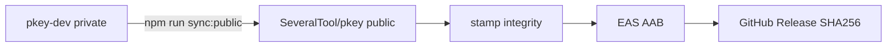

# Deployment and Builds

How to build PKEY for development and release, embed the PWA, and verify artifact integrity with SHA-256. Commands assume the repository root after `npm ci`.

## Build pipeline overview

```text
build:core  →  build:web  →  embed:pwa   (= prebuild:mobile)
                                    ↓
                         src/web/generated/pwaHtml.ts + pwaAssets.ts
                                    ↓
              Expo / Gradle / EAS  →  APK or AAB
```

| Command | Role |
|---------|------|
| `npm run prebuild:mobile` | Build core + web + embed PWA |
| `npm run refresh:pwa` | Rebuild web + embed (Metro reload; no APK reinstall) |
| `npm run build:apk` | Local debug APK → `builds/android/pkey-debug.apk` |
| `npx expo run:android` / `run:ios` | Native run from source |
| `eas build` | Cloud builds via `eas.json` profiles |
| `npm run stamp:integrity` | Stamp git commit into `app.json` before a store AAB |
| `npm run check:16kb -- file.aab` | Pre-upload ELF 16 KB check (Play Console still authoritative) |

Script details: [SCRIPTS.md](./SCRIPTS.md).

## Android

### Local debug APK

Requires Android SDK (`ANDROID_HOME` or `ANDROID_SDK_ROOT`).

```bash
npm run prebuild:mobile   # if PWA / core changed
npm run build:apk
# Output: builds/android/pkey-debug.apk
```

`scripts/build-apk.mjs` writes `android/local.properties` if needed, runs Gradle `assembleDebug`, and copies the APK to `builds/android/`.

### Development client

```bash
npx expo run:android
# or
eas build --profile development --platform android
```

LAN web access, mDNS, and migration need a **development or production build**, not Expo Go.

### Release (AAB)

`eas.json` **production** profile builds an Android App Bundle. Full store recipe (stamp, 16 KB, hash): [Store AAB](#store-aab-production). Preview/internal profiles use APK — do not upload those to Play production.

## iOS

```bash
npx expo run:ios
# Simulator-oriented development profile:
eas build --profile development --platform ios
eas build --profile production --platform ios
```

Apple signing, App Store Connect, and privacy labels are outside this repo; legal checklist: [legal/README.md](./legal/README.md).

## PWA (embedded web client)

1. `npm run build:web` — Vite single-file HTML in `packages/web-client/dist/`
2. `npm run embed:pwa` — writes `src/web/generated/pwaHtml.ts` and `pwaAssets.ts`
3. Mobile `SyncWebServer` serves the HTTP HTML shell **and** the icon/manifest allowlist on port **7392** (browser tab only)

Launcher and OS notification icons live in the native binary (`app.json` → `icon` / `adaptiveIcon` / `expo-notifications`). Changing those requires a native rebuild (`npx expo run:android|ios` or EAS), not Metro reload. In-page PWA logos update with `refresh:pwa` + Metro.

Day-to-day iteration with an installed dev client:

```bash
npm run refresh:pwa
# Reload Metro JS bundle; hard-refresh the browser on :7392
```

Do **not** rebuild the APK unless native code, launcher/notification icons, or a standalone release changed. See [WEB_CLIENT.md](./WEB_CLIENT.md).

## EAS profiles (`eas.json`)

| Profile | Distribution | Android | iOS notes |
|---------|--------------|---------|-----------|
| `development` | internal | debug APK (`assembleDebug`), development client | simulator |
| `preview` | internal | APK | — |
| `production` | store | App Bundle (AAB) | production |

CLI version constraint: `>= 16.0.0`. **`appVersionSource: "local"`** — the Play AAB uses `expo.version` / `android.versionCode` from `app.json` (keep them in lockstep with root `package.json`). Do not switch back to `remote` for the first store upload or EAS can ignore the git version.

`submit.production` is empty on purpose: upload the AAB in Play Console, or later add a Play service-account JSON path. Do not commit that JSON.

### Public snapshot and store AAB

`stamp:integrity` writes `git rev-parse HEAD` into `app.json`. That SHA must exist on **`SeveralTool/pkey`** (public), not only on `pkey-dev`.



Maintainer recipe:

```bash
# 1. Copy this working tree into a separate clone of SeveralTool/pkey
npm run sync:public -- ../pkey-public
cd ../pkey-public
git add -A
git commit -m "chore: public snapshot"
git push origin main

# 2. Stamp the PUBLIC commit, commit app.json, push again
npm run stamp:integrity
git add app.json
git commit -m "chore: stamp build integrity"
git push origin main

# 3. Store AAB (run on your machine; not from the coding agent)
npm run prebuild:mobile
eas build --profile production --platform android
```

Then [Store AAB checks](#store-aab-production). Play App Signing re-signs what users install; publish the SHA-256 of the **upload AAB** on the public GitHub Release. That hash will not match the Play-delivered APK.

Upload key: `eas credentials -p android` → download keystore → encrypted ZIP on USB, never git. First Play upload: enable Play App Signing. Package `com.severaltool.pkey` is immutable.

Create/download the upload keystore (interactive Expo menu, on your machine):

Expo dashboard (same project): https://expo.dev/accounts/severaltool/projects/pkey/credentials

```bash
eas credentials -p android
```

Choose the **production** Android profile. If none exists, let EAS generate it. Then **Download credentials** and store the `.jks` + passwords offline. Do not commit them. Play Console → App signing → Play App Signing must be on before the first production AAB is trusted as the official signing identity.

### Store AAB (production)

Run from a **clean git commit on the public repo** that you intend to ship (the integrity stamp embeds `HEAD`):

```bash
npm run stamp:integrity
npm run prebuild:mobile
eas build --profile production --platform android
```

Download the AAB, then:

```bash
npm run check:16kb -- path/to/PKEY.aab
Get-FileHash -Algorithm SHA256 path\to\PKEY.aab
```

Play Console → App bundle explorer → **Memory page size** is still the official 16 KB verdict. If `check:16kb` or Play reports 4 KB native libs, update the `.so` (typical suspects: `react-native-tcp-socket`, `zeroconf`, `quick-crypto`, `nitro-modules`, `pkey-autofill`, `pkey-web-access`). Do **not** lower `targetSdk`.

`expo-build-properties` pins `compileSdkVersion` / `targetSdkVersion` **36** and `useLegacyPackaging: false` (required for 16 KB). Native modules fall back to 36 if `rootProject.ext` is missing.

Internal APK preview (not for Play production):

```bash
eas build --profile preview --platform android
```

## SHA-256 verification (transparency)

Official and self-built binaries should be verifiable by hash so auditors can confirm they have the artifact they expect.

### Compute a digest

**Windows (PowerShell):**

```powershell
Get-FileHash -Algorithm SHA256 builds\android\pkey-debug.apk
```

**macOS / Linux:**

```bash
shasum -a 256 builds/android/pkey-debug.apk
# or: sha256sum builds/android/pkey-debug.apk
```

For EAS artifacts, download the APK/AAB from the Expo dashboard or CI release, then hash the file the same way.

### Recommended release practice

When publishing a build for audit or store distribution:

1. Record the **git commit SHA** used for the build.
2. Publish the **SHA-256** of each distributed APK/AAB next to the release notes (GitHub Release, website, or [CHANGELOG.md](./CHANGELOG.md)).
3. Auditors compare `Get-FileHash` / `sha256sum` output to the published digest.

This repository does not ship pre-generated hash files for every CI artifact; hashes are produced from the binary you build or download.

## Environment

| Variable | Purpose |
|----------|---------|
| `ANDROID_HOME` / `ANDROID_SDK_ROOT` | Local Android SDK for Gradle / `build:apk` |
| `CI` | CI / Playwright |

No cloud vault API keys — builds do not embed vendor sync credentials. Copy [`.env.example`](../.env.example) only for local SDK overrides.

Play Store launch work (listing, Data safety, legal URLs, staged rollout) lives in [DEPLOY_CHECKLIST.md](./DEPLOY_CHECKLIST.md), not in this file.

## Related

- [DEPLOY_CHECKLIST.md](./DEPLOY_CHECKLIST.md) — Google Play publication checklist
- [GETTING_STARTED.md](./GETTING_STARTED.md)
- [SECURITY.md](./SECURITY.md) — vulnerability reporting and audit posture
- [PERFORMANCE.md](./PERFORMANCE.md) — release profiling notes
