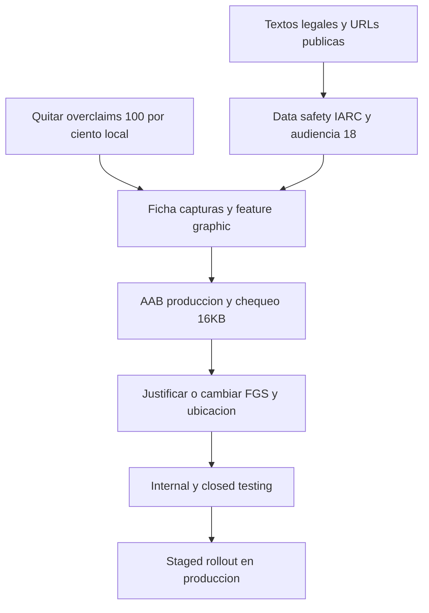

# Google Play — checklist de publicación

Tracker vivo para el primer envío de PKEY a Google Play. El **cómo construir** el binario está en [DEPLOYMENT.md](./DEPLOYMENT.md). Los **borradores legales** están en [legal/](./legal/). Este archivo es la lista de trabajo: se marca aquí, no se duplica el estado en otros docs.

**Veredicto inicial:** no publicar todavía. El producto local-first está maduro (cifrado en dispositivo, AAB de producción, sin anuncios ni IAP, autofill Android, pantalla Legal). Falta la capa de distribución: ficha, URL pública, Data safety. Los textos de política / términos / avisos de producto in-app ya siguen la regla de **sin fechas ni nombres**; los avisos OSS y la licencia de código conservan copyrights.

Esta auditoría no es asesoramiento jurídico. Aunque el cuerpo in-app omita nombres, los textos finales deberían pasar por un abogado de la jurisdicción desde la que se publica.

## Cómo usar este archivo

Sí: un checklist único es buena administración si se cumplen estas reglas.

1. **Este archivo es la fuente de verdad** del lanzamiento a Play. [DEPLOYMENT.md](./DEPLOYMENT.md) no se convierte en un segundo tracker.
2. **Arriba se trabaja, abajo se consulta.** Las secciones 1–6 son casillas. El resto es referencia (por qué, cómo, borradores).
3. Al zanjear un ítem: pasar `[ ]` a `[x]`, cambiar el semáforo `FALTA` / `PARCIAL` → `HECHO` (o `N/A`), y si hace falta una nota de una línea en [Notas de progreso](#notas-de-progreso). No borrar el contexto: mañana hay que saber *qué* se decidió.
4. Un ítem `PARCIAL` no se tacha hasta que el resto deje de ser riesgo de rechazo o de Data safety inexacto.
5. Los avisos OSS (`THIRD_PARTY_NOTICES`) son la **excepción** a “sin nombres”: las licencias MIT exigen conservar el copyright original.

| Marca | Significado |
|-------|-------------|
| `[ ]` | Pendiente |
| `[x]` | Hecho o explícitamente N/A |
| **HECHO** | Cerrado |
| **PARCIAL** | Hay base, falta un cierre |
| **FALTA** | Bloquea o no está |
| **N/A** | No aplica (dejar nota) |

### Orden de trabajo



### Notas de progreso

Añadir una viñeta al cerrar un bloqueante o al cambiar una decisión (FGS, ubicación, audiencia).

- Bloques 4–5: política/términos/official-app sin fechas ni nombres; consentimiento legal al crear sesión (sin declaración de 18+); Cancel de filtraciones ya no deja el toggle encendido; copy “100% local” / “no sale a internet” corregidos; PBKDF2 docs a 600k.
- Bloque 3 + ficha de texto: playbook [legal/PLAY_CONSOLE.md](./legal/PLAY_CONSOLE.md) y [store/PLAY_LISTING.md](./store/PLAY_LISTING.md). Android 13+ lee SSID con `NEARBY_WIFI_DEVICES` (`neverForLocation`); ubicación acotada a API 32. Nombre visible PKEY. FGS sigue `connectedDevice` (declarar en Console; no se cambió el tipo). Capturas y pegar formularios en Console siguen pendientes.
- Bloque 1 (build): versiones alineadas en `1.0.31` / 31; EAS `appVersionSource: local`; `targetSdk` 36 pineado; `useLegacyPackaging: false`; `npm run check:16kb`. No se corrió EAS ni `stamp:integrity` (hace falta commit público + AAB).

---

## Identidad del binario (snapshot)

Valores leídos en el repo al armar este tracker. Actualizar la tabla si cambian.

| Campo | Valor | Evidencia |
|--------|--------|-----------|
| Nombre Expo | `PKEY` | `app.json` → `expo.name` |
| Package Android | `com.severaltool.pkey` | `app.json` → `expo.android.package` |
| Bundle iOS | `com.severaltool.pkey` | `app.json` |
| Versión Expo | `1.0.31` | `app.json` → `expo.version` |
| `versionCode` | `31` | `app.json` → `android.versionCode` |
| `package.json` | `1.0.31` | `package.json` |
| Orientación | `portrait` | `app.json` |
| Scheme | `pkeysync` | `app.json` |
| Owner EAS | `severaltool` | `app.json` |
| EAS `projectId` | `d63bdc8d-1197-42a0-a353-0f2c74dc7f75` | `app.json` → `extra.eas` |
| SDK | Expo ~56.0.20, RN 0.85.3 | `package.json` |
| `targetSdk` | **36** pineado | `app.json` → `expo-build-properties` |
| Producción | AAB (`buildType: "app-bundle"`) | `eas.json` → `build.production` |
| `appVersionSource` | `local` | `eas.json` |
| `submit.production` | `{}` (subida manual del AAB) | `eas.json` |

No hay carpeta `android/` versionada. El manifiesto final lo genera prebuild/EAS.

---

## 1. Identidad y build

- [ ] **PARCIAL** — Package `com.severaltool.pkey` definido; confirmar que Play lo acepte (inmutable tras la primera subida)
- [x] **HECHO** — Versión alineada: Expo `1.0.31` / `versionCode` 31 / `package.json` `1.0.31`; EAS `appVersionSource: local`
- [x] **HECHO** — Perfil EAS `production` = AAB (no subir el APK de `preview` a producción)
- [x] **HECHO** — Subida a Play: **manual** del AAB (`submit.production` vacío a propósito; no commitear JSON de cuenta de servicio)
- [x] **PARCIAL** — Play App Signing: EAS ya tiene upload keystore `xfmJ0QpOWj`. Falta **descargar backup** (`eas credentials -p android`) y activar Play App Signing en la primera subida.
- [ ] **FALTA** — `npm run stamp:integrity` en el commit que se envía a EAS (el sello actual del repo no es de tienda)
- [x] **HECHO** — `targetSdk` / `compileSdk` **36** pineados; módulos nativos fallback 36; `useLegacyPackaging: false`
- [ ] **PARCIAL** — Script `npm run check:16kb -- file.aab` listo; falta correrlo sobre el AAB de producción y confirmar en Play Console
- [ ] **PARCIAL** — Probar edge-to-edge y predictive back en API 35+ (no se activó predictive back a ciegas)

Comando de AAB de tienda (detalle en [DEPLOYMENT.md](./DEPLOYMENT.md)):

```text
npm run stamp:integrity
npm run prebuild:mobile
eas build --profile production --platform android
```

Candidatos nativos a revisar si falla 16 KB: `react-native-tcp-socket`, `react-native-zeroconf`, `react-native-quick-crypto`, `react-native-nitro-modules`, `pkey-autofill`, `pkey-web-access`. No bajar `targetSdk` para “arreglarlo”.


---

## 2. Gráficos y ficha de Play Store

- [x] **HECHO** — Icono 1024×1024 y Adaptive Icon 1024×1024, fondo `#000000` (`assets/images/`)
- [x] **HECHO** — High-res 512×512 y Feature Graphic 1024×500 en `assets/logo/v6/` (falta **subirlos** a Console)
- [x] **HECHO** — Capa monochrome 1024 en `app.json` (`assets/images/adaptive-icon-monochrome.png`)
- [ ] **FALTA** — Capturas teléfono: mínimo 2, ideal 4–8, 1080×1920 o 1080×2340 — receta en [store/PLAY_LISTING.md](./store/PLAY_LISTING.md)
- [ ] **N/A** — Capturas tablet 7"/10": solo si se declara tablet y se vio bien en portrait
- [ ] **N/A** — Vídeo promocional (opcional). Si se hace: sin “100% local” ni “irrompible”
- [x] **HECHO** — Título, corta, larga, categoría y tags redactados en [store/PLAY_LISTING.md](./store/PLAY_LISTING.md) (falta **pegarlos** en Console)
- [x] **HECHO** — Nombre visible `PKEY` en `app.json` y copy de cámara
- [x] **HECHO** — URL pública HTTPS: https://severaltool.github.io/pkey/ (Pages activo). Pegar privacidad/términos en Console.
- [ ] **FALTA** — Email de soporte en la ficha (campo de Console; no va en el código)

La app tiene `allowScreenshots: false` por defecto. Para capturas de tienda hace falta un build temporal que las permita. **Nunca** mostrar datos reales de una bóveda.

**ASO honesto (borrador):**

| Campo | Ejemplo |
|--------|---------|
| Título | `PKEY` o `PKEY Password Manager` |
| Corta | `Gestor de contraseñas local. Bóveda cifrada en tu dispositivo.` |
| Categoría | **Tools** o **Productivity**, no Finance |
| Etiquetas | password manager, 2FA, offline… sin “banco” |
| Larga | Local-first, sin nube del editor, autofill **solo Android**, LAN opcional. Internet para enlaces, iconos opcionales y chequeo de filtraciones opcional. No: “nunca sale a internet”, “militar”, “imposible de hackear”. |

Idiomas: la app es ESP/ING. Los cuerpos legales in-app están **solo en inglés**. La ficha mínimo en los idiomas de los países objetivo.

---

## 3. Permisos y declaraciones Play Console

- [x] **HECHO** — Permisos listados; propósito para Console en [legal/PLAY_CONSOLE.md](./legal/PLAY_CONSOLE.md)
- [x] **HECHO** — Formulario **Data safety** redactado (hay que **pegarlo** en Console)
- [x] **HECHO** — IARC / content rating: respuestas en el playbook (pegar en Console)
- [x] **HECHO** — Público objetivo **18+** en playbook. **Sin** Restrict Minor Access. No Designed for Families. Falta marcar Console
- [x] **HECHO** — Sin anuncios / sin SDKs de ads
- [x] **HECHO** — Sin IAP / Billing / suscripciones (gratis)
- [x] **HECHO** — Cuestionario de exportación de cifrado: respuestas en el playbook (pegar en Console)
- [ ] **PARCIAL** — Tipo FGS `connectedDevice` se **declara** con el texto del playbook; no se cambió el tipo nativo
- [x] **HECHO** — Sin `QUERY_ALL_PACKAGES`, `DEVICE_ADMIN`, Accessibility Service, `ACCESS_BACKGROUND_LOCATION`
- [x] **HECHO** — Android 13+: `NEARBY_WIFI_DEVICES` + `neverForLocation`; FINE/COARSE con `maxSdkVersion` 32 (`plugins/with-wifi-ssid-permissions`)
- [x] **HECHO** — News / COVID / Health / Government / VPN: **No** (playbook). El HTTP LAN **no** es VPN
- [x] **HECHO** — Financial features: **No** (playbook). Confirmar el texto vigente del formulario al pegar

Permisos en `app.json`: `POST_NOTIFICATIONS`, `CAMERA`, `INTERNET`, `ACCESS_NETWORK_STATE`, `ACCESS_WIFI_STATE`, `CHANGE_WIFI_MULTICAST_STATE`, `FOREGROUND_SERVICE`, `FOREGROUND_SERVICE_CONNECTED_DEVICE`. Location FINE/COARSE las añade `expo-location` con `maxSdkVersion` 32. Android 13+: `NEARBY_WIFI_DEVICES` + `neverForLocation`. Autofill: `BIND_AUTOFILL_SERVICE` (**no** marcar Accessibility API).

**Riesgos a zanjear antes del review:**

1. **SSID:** divulgación in-app antes del diálogo (`lan_ssid_rationale`). Android 13+ ya no usa ubicación precisa. Verificar en un dispositivo API 33+ tras rebuild nativo.
2. **FGS `connectedDevice`:** se declara con el texto de [legal/PLAY_CONSOLE.md](./legal/PLAY_CONSOLE.md). Plan B si Play rechaza: `specialUse`.
3. **Cleartext:** `usesCleartextTraffic: false` en `app.json`, pero el plugin de network security permite cleartext global (Android no admite CIDR). Data safety no debe decir “todo el tráfico es HTTPS”.
4. Cámara y notificaciones: pedirlas en el momento de uso (cámara ya; notificaciones al usar avisos OS).

Formulario completo para copiar: [legal/PLAY_CONSOLE.md](./legal/PLAY_CONSOLE.md).

### Data safety — respuestas honestas (código actual)

| Pregunta | Respuesta |
|----------|-----------|
| ¿Recogéis datos en servidores propios? | **No** (no hay backend de bóveda) |
| Ubicación | **No recogida**. Permiso on-device para SSID. Sin GPS ni envío |
| Contraseñas / secretos | El editor **no** las recoge. Cifradas en el dispositivo |
| Biometría | Plantillas en el SO, no en la app ni en un servidor |
| Identificadores | `deviceId` local (AsyncStorage) para pairing LAN; no se envía al editor |
| Compartido con terceros | **Sí, solo si el usuario activa:** (1) hostname a CDNs de favicons; (2) prefijo SHA-1 de 5 caracteres a API pública de contraseñas filtradas |
| Cifrado en tránsito | Canal LAN cifrado en aplicación; HTTP claro posible a IPs LAN |
| Cifrado en reposo | Sí. Envelope v4: Argon2id + XChaCha20-Poly1305. No afirmar AES-GCM para la bóveda. |
| Ads / analytics / crash cloud | No |
| Eliminación | Desinstalar o borrar la bóveda. El editor no puede borrar lo que no aloja |

Cualquier red nueva (analytics, HIBP on por defecto) = actualizar Data safety **antes** del siguiente AAB.

---

## 4. Legal (sin fechas ni nombres en política / términos / avisos de producto / consentimientos)

Regla de producto: esos textos **no** llevan fechas ni nombres (personas, empresas, entidades). Play Console, GDPR y MIT **sí** exigen identidad del editor o copyright OSS: la cuenta de Play no puede ser anónima; `THIRD_PARTY_NOTICES` conserva créditos.

- [x] **HECHO** — Política de privacidad sin fechas ni nombres (`legalContent.ts` + `docs/legal/PRIVACY_POLICY.md`)
- [x] **HECHO** — Términos de uso sin fechas ni nombres (sin jurisdicción ni marcas de tienda)
- [x] **HECHO** — Modal anclado a la versión de la app; se eliminó `LEGAL_LAST_UPDATED`
- [x] **HECHO** — Privacidad in-app menciona el chequeo de filtraciones por prefijo de hash; sin Google Fonts ni Iconify
- [x] **HECHO** — Pantalla Legal in-app; `LEGAL_WEB_URLS` apunta a GitHub Pages; cuerpos solo en inglés
- [x] **HECHO** — Checkbox al **crear la bóveda** (también importar y recibir migración)
- [x] **HECHO** — Consentimientos de filtraciones / favicons sin marcas; copy de prefijo de hash
- [x] **HECHO** — Cancel en el toggle de filtraciones **no** persiste el opt-in (`SettingsTab.tsx`)
- [x] **HECHO** — Defaults privacy-first: `enableHibpCheck: false`, `enableFaviconLookup: false`
- [ ] **PARCIAL** — Intro OSS en avisos de terceros; falta `npm run legal:notices` antes del AAB de tienda. **No** quitar copyrights OSS
- [ ] **FALTA** — Revisión de abogado: **N/A** (no forma parte del lanzamiento)
- [x] **HECHO** — Sin age gate in-app ni fecha de nacimiento. Privacidad: no dirigida a menores de 13 (COPPA). Términos: capacidad de contratar o autorización de quien la tenga
- [x] **N/A** — Política infantil / COPPA separada: no, si no está dirigida a niños, público Console 18+ y no Designed for Families
- [ ] **PARCIAL** — `webAccess` ya no dice “no sale a internet”; otros procedimientos de importación aún nombran gestores de terceros
- [ ] **FALTA** — PWA sin pantalla de privacidad (`packages/web-client`)

Inventario: `docs/legal/*.md`, `src/constants/legalContent.ts`, `legalContact.ts`, `LegalSettingsSection.tsx`, `LegalDocumentModal.tsx`, `src/constants/procedures/`.

**Límites que no se pueden “anonimizar”:**

1. Cuenta Play anónima — no.
2. Borrar copyright MIT de terceros — no.
3. GDPR sin responsable si hay usuarios EEE — el responsable de HIBP/favicons existe. Compromiso: “el editor de esta aplicación según la ficha de la tienda”.

Borradores listos para pegar: [Apéndice A](#apéndice-a--borradores-sin-fechas-ni-nombres).

---

## 5. Copy, crypto y flujos in-app (antes del review)

- [x] **HECHO** — Quitar “Tus claves están 100% locales” / `app_desc` “100% local” (`src/constants/localization.ts`)
- [x] **HECHO** — Docs `ARCHITECTURE.md` / `CORE_PACKAGE.md`: v3 = **600.000**; legacy = 100.000
- [x] **HECHO** — Política: derivación Argon2id y AEAD XChaCha20-Poly1305 (v4); wire LAN aún CBC+HMAC en gracia v2
- [x] **HECHO** — Prompt de filtraciones: prefijo de hash; Cancel no activa
- [x] **HECHO** — Autofill: copy in-app distingue Android / iOS; la ficha lo dice en [store/PLAY_LISTING.md](./store/PLAY_LISTING.md) (falta pegar en Console)
- [x] **HECHO** — Biometría: docs de unlock aclaran `rootKeyHex` en SecureStore, no la master password
- [ ] **PARCIAL** — Accesibilidad: labels en UI; CI `test:a11y` solo PWA; RemoteViews de autofill pobres
- [x] **HECHO** — `AppErrorBoundary` oculta el mensaje crudo
- [x] **HECHO** — Cámara on-demand (`otpCameraPermission.ts`); ubicación con rationale (`lan_ssid_rationale`)

Claims de cifrado **permitidos**: Argon2id (64 MiB, t=3, p=1) → XChaCha20-Poly1305 (bóveda v4); HMAC-SHA256 en el wire de sync durante la gracia v2/v3; Keystore/Keychain user-auth. **Prohibidos** en ficha: AES-GCM para la bóveda, “E2E cloud”, “zero-knowledge servidor”, “inquebrantable”, “100% local”.

| Canal | Qué pasa |
|--------|----------|
| Bóveda | Disco del sandbox de la app |
| LAN PWA `:7392` | HTTP + WS en LAN; keep-alive FGS |
| Migración `:7393` / `:7394` | TLS entre pares |
| Favicons | Opt-in; hostname a CDNs |
| HIBP | Opt-in; `https://api.pwnedpasswords.com/range/` |
| Links / GitHub | Solo si el usuario abre el enlace |
| Export | CSV/JSON en claro o `.pkey` cifrado; destino = share sheet |
| Portapapeles | `copySecret` + auto-clear ~30s; dato en dispositivo, no recogido |

---

## 6. Calidad, lanzamiento y monitoreo

- [x] **HECHO** — Error boundary móvil y PWA
- [x] **HECHO** — CI: Jest, Vitest, Playwright e2e PWA, `audit-ci`, lint, `docs:validate`
- [x] **HECHO** — Sin secretos de cloud en repo (`.env` ignorado; no `google-services.json`)
- [ ] **FALTA** — QA en dispositivos reales: Android 8, 13 (notif runtime), 14, 15/16 (16 KB, edge-to-edge, FGS), un tablet, un dispositivo sin biometría
- [ ] **FALTA** — Matriz autofill / biometría / LAN / migración / export-import en hardware
- [ ] **PARCIAL** — Tests instrumentados Android / Maestro / Detox: no hay. `perf` y `validate-otp` en CI con `continue-on-error`
- [ ] **FALTA** — Internal testing (hasta 100 testers) con el AAB de producción
- [ ] **FALTA** — Closed testing (conviene 12+ testers; a veces Play lo exige antes de producción)
- [ ] **N/A** — Open testing (opcional, reseñas tempranas)
- [ ] **FALTA** — Staged rollout producción: 10% (48–72 h) → 25% → 50% → 100%. **No** 100% el día 1
- [ ] **FALTA** — Play Vitals el día 1: crashes, ANR, 16 KB, edge-to-edge, denegación de ubicación
- [ ] **N/A** — Crashlytics / Sentry: no hay (coherente con local-first). Consecuencia: solo Vitals + reseñas. Responder **sin pedir secretos**
- [ ] **PARCIAL** — Integridad de build visible in-app; firma muestra “unknown”
- [ ] **FALTA** — Publicar SHA-256 del AAB subido ([DEPLOYMENT.md](./DEPLOYMENT.md#sha-256-verification-transparency)); Play re-firma, el APK universal tiene otro hash

Capturas de adquisición: login, lista, generador, LAN, autofill Android — datos ficticios. No comprar installs con “más seguro que el banco”.

---

## Bloqueantes para pulsar “Enviar a revisión”

No enviar mientras alguno de estos esté `FALTA`:

- [x] 1. Hospedar política y términos en HTTPS — https://severaltool.github.io/pkey/privacy.html — **falta pegar la URL en Play Console**
- [ ] 2. Pegar Data safety en Console (texto en [legal/PLAY_CONSOLE.md](./legal/PLAY_CONSOLE.md); HIBP + favicons opt-in)
- [ ] 3. Content rating + audiencia 18+ en Console (respuestas en el playbook; **sin** Restrict Minor Access; **sin** checkbox 18+ in-app)
- [ ] 4. Capturas reales de teléfono
- [x] 5. Reescribir legales según la regla (excepción OSS) — in-app y `docs/legal/`; falta URL pública (ítem 1)
- [x] 6. Consentimiento al crear la bóveda
- [ ] 7. AAB production: `stamp:integrity` en commit limpio + `eas build --profile production` + `check:16kb` + Memory page size en Console
- [ ] 8. Justificar o cambiar FGS y ubicación
- [x] 9. Quitar overclaims “100% local” / “no internet”
- [ ] 10. Email de contacto en la ficha

---

## Referencia — proceso Play Console (paso a paso)

No está automatizado en el repo. `eas.json` `submit.production` está vacío.

1. Crear cuenta Play Console (tarifa única) con identidad real. Los textos in-app pueden omitir nombres; la cuenta no.
2. Verificar identidad / organización.
3. Crear la app con nombre **PKEY** (máx. 30; no uses el `name` Expo `pkey`).
4. Confirmar paquete `com.severaltool.pkey`.
5. Activar Play App Signing; guardar backup de upload key.
6. Enlazar EAS (`eas submit`) o subir el AAB a mano.
7. Completar “App content”: privacidad, ads, target audience, news, COVID, data safety, cifrado/export, permisos, FGS.
8. Countries / pricing: **Free**. El formulario de export puede limitar países.
9. Device catalog: no excluir Android 8+ sin motivo.
10. Pistas: Internal → Closed → (Open opcional) → Production staged.
11. Privacy Policy reachable **sin login**.

| Declaración Play | ¿Aplica a PKEY? |
|------------------|-----------------|
| Política de privacidad | Sí, URL pública |
| Data safety | Sí |
| Content rating IARC | Sí |
| Público objetivo | 18+ |
| News / COVID / Health / Government | No |
| VPN / proxy | No (LAN HTTP no es VPN) |
| Financial features | En principio no |
| Exportación de cifrado | Sí |
| Permissions | Cámara, ubicación o Nearby Wi‑Fi, notificaciones, FGS, red local |
| Accessibility API | No (es AutofillService) |
| Ads / IAP | No |
| Photo/Video library | No, si solo cámara para QR |

Orientación `portrait`: Play ya no exige landscape. No marcar “optimizado para tablets” sin probarlo.

---

## Referencia — GDPR / COPPA / permisos sensibles

| Documento | ¿Hace falta? |
|-----------|----------------|
| Política infantil / COPPA | **No** como app para niños (público 18+, no Families). El texto de privacidad usa umbral COPPA: menores de 13 |
| GDPR | Informativa + consentimiento para HIBP/favicons. Sin servidor de bóveda no hay acceso/rectificación contra una base propia |
| DPA / SCC | No (no hay procesador cloud de bóveda) |
| Registro de actividades | Interno, no en el repo |
| Declaración de cifrado | Formulario Play |
| Justificación FGS / ubicación | Sí, en Console |

Autofill: no aplica el disclosure de Accessibility; conviene un párrafo: la app puede leer campos de login de otras apps **solo** cuando el sistema pide autocompletar y el usuario la eligió como servicio.

---

## Apéndice A — borradores sin fechas ni nombres

Pegar (traducir al inglés in-app si la UI legal sigue en un solo idioma) y revisar con abogado. Anclar a la versión de la app, no a una fecha.

### Política de privacidad

> Política de privacidad de esta aplicación
>
> Este texto describe cómo la aplicación trata información. No es un contrato con una persona o entidad identificada por nombre.
>
> Resumen: gestor de contraseñas local. La bóveda cifrada vive en el dispositivo. La aplicación no opera una nube de bóveda y no recibe la contraseña maestra, el contenido descifrado ni las claves de descifrado en el uso normal.
>
> 1. Qué no se recoge: contraseñas maestras ni secretos; contenido descifrado; plantillas biométricas; un perfil de cuenta central ligado a la bóveda.
> 2. Qué queda en el dispositivo: base cifrada; claves y sales en el almacén seguro del sistema cuando está disponible; ajustes; un identificador de instalación para emparejar en la red local; certificados de migración entre tus dispositivos; lote opcional de desbloqueo biométrico (verificado por el sistema). La contraseña maestra no se puede recuperar si se pierde.
> 3. Permisos: cámara solo al escanear códigos; red local para acceso web, migración o sincronización entre dispositivos propios; ubicación opcional solo para leer el nombre de la Wi‑Fi en el dispositivo (sin coordenadas ni envío); notificaciones locales; Internet para enlaces que abras, importación que elijas, iconos de sitios si activás esa opción, y un chequeo opcional de filtraciones que envía únicamente un prefijo corto de un hash (no la contraseña ni el hash completo).
> 4. Contacto: el canal de soporte de la ficha de la tienda. No envíes la contraseña maestra ni exportaciones.
> 5. Terceros (sin nombres): tiendas del sistema; proveedores de iconos si activás la búsqueda remota (se envía el nombre de host); servicio opcional de prefijos de hash; almacén seguro y biometría del sistema.
> 6. Publicidad y analítica: esta versión no incluye kits de publicidad ni analítica de terceros.
> 7. Menores: no está dirigida a menores de 13 años. El editor no recoge a sabiendas información personal de menores de 13.
> 8. Derechos: los datos de la bóveda están en tu dispositivo. Para borrar: desinstalá o borrá los datos de la aplicación. El editor no puede borrar una bóveda que no aloja.
> 9. Seguridad: cifrado de bóveda en el dispositivo (derivación de clave por contraseña y cifrado autenticado). Ningún sistema es infalible.
> 10. Cambios: si este texto cambia, se actualiza dentro de la aplicación junto con una versión nueva.

### Términos de uso

> Al instalar o usar la aplicación aceptás estos términos. Si no aceptás, no la uses.
>
> Capacidad: al aceptar, declarás tener capacidad para contratar, o que una persona con esa capacidad autorizó este uso.
>
> Licencia: uso personal o interno en dispositivos que controlás, no exclusiva e intransferible. No incluye redistribuir ni presentarla como build oficial.
>
> No está permitido eludir controles de seguridad, redistribuir copias modificadas ni usarla para violar la ley.
>
> La bóveda es local. Nadie del canal de distribución puede recuperar tu contraseña maestra. Sos responsable de copias de seguridad y de la red local si activás acceso web o migración.
>
> Se ofrece “tal cual”. En la medida que permita la ley, no hay garantía de disponibilidad ni de que los datos no se pierdan.
>
> Criptografía: debés respetar las normas de exportación aplicables.
>
> Fin: desinstalá la aplicación.

Quitar ley aplicable y tope de responsabilidad deja el contrato más débil: es una decisión de producto.

### Consentimientos (sin marcas)

**HIBP:** Al activarlo, la aplicación puede consultar un servicio público de filtraciones enviando solo los primeros caracteres de un hash, no la contraseña. Las nuevas se consultan al guardar. Las ya guardadas solo si confirmás una comprobación masiva. Requiere Internet. Desactivado por defecto.

**Favicons:** Al activarlo, la aplicación pide iconos de sitio a servidores ajenos usando el dominio de la tarjeta. Eso puede revelar qué sitios guardaste. Desactivado por defecto.

**Alta de bóveda:** checkbox “He leído el texto de privacidad y los términos”, con enlaces a los documentos, sin declaración de edad y sin “acepto el contrato con [empresa]”.

**Procedimientos:** “navegador”, “app de archivos”, “otro gestor”. Acceso web: el tráfico de la bóveda va por la red local; no usar redes públicas.

---

## Relacionado

- [DEPLOYMENT.md](./DEPLOYMENT.md) — builds, EAS, SHA-256
- [legal/README.md](./legal/README.md) — plantillas legales (draft)
- [SECURITY.md](./SECURITY.md) — postura de auditoría
- [AUTOFILL.md](./AUTOFILL.md) — servicio Android
- [NATIVE_MODULE_WEB_ACCESS.md](./NATIVE_MODULE_WEB_ACCESS.md) — FGS LAN
