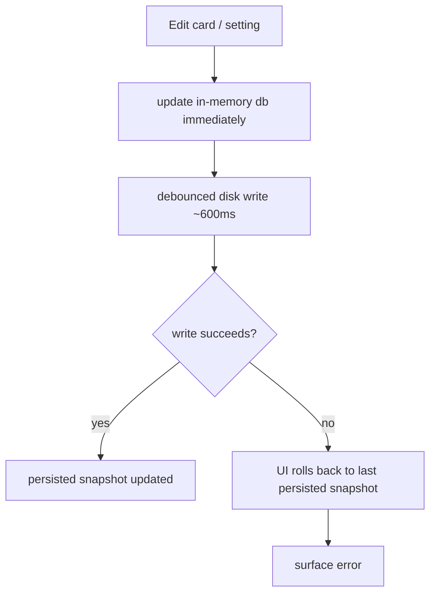
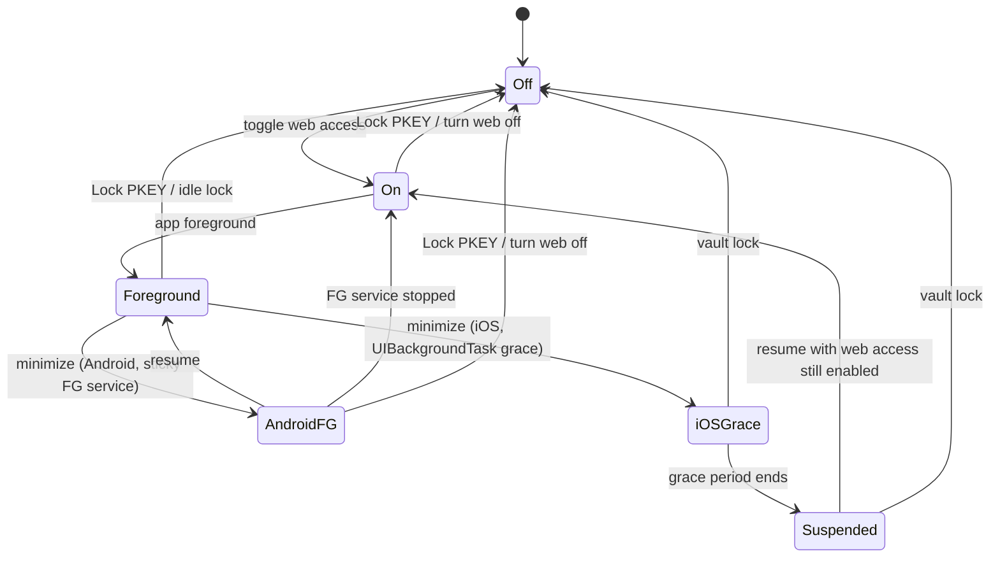
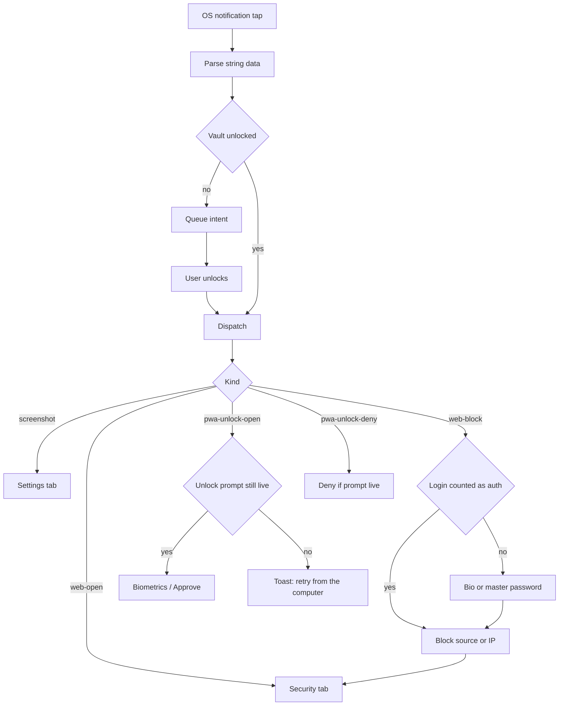

# Mobile App (`src/`)

Expo React Native application layer for PKEY: UI, navigation, React context, device services (storage, biometrics, LAN sync/migration), and the embedded PWA shell.

Shared crypto, sync protocol, importers, and vault helpers live in [`@pkey/core`](./CORE_PACKAGE.md) — do not reimplement domain logic when a core export already exists.

## Layout

```text
App.tsx
  └─ bootstrap/cryptoPolyfill + Buffer
  └─ splash stays up until `sessionGate` is ready/error and that login frame has painted
  └─ LoginScreen does not mount create-session vs unlock until the vault file check resolves (I/O error ≠ new install)
  └─ native crypto KAT is scheduled after the first interactions
  └─ AppErrorBoundary → GestureHandler → SafeArea → AppProvider
       └─ LoginScreen | lazy DashboardScreen
            └─ DashboardTabNavigator (native UITabBar / BottomNavigationView)
                 Cards is eager; Stats, Security, and Settings load on first visit
       └─ global overlays (prompt, busy, delete-all, icon, notifications, migration)

src/
├── bootstrap/       Early polyfills (crypto.getRandomValues)
├── components/      Reusable UI (cards, common, sync, security, import, migration, notifications overlay)
├── constants/       Config, localization (ESP/ING), icons, legal content
├── context/         Auth, database, settings, notifications, sync, migration, UI providers
├── hooks/           Password gen, analysis, stats, links
├── navigation/      Native dashboard tabs (React Navigation Bottom Tabs, not Expo Router)
├── notifications/   In-app toast/alert queue + OS helpers (no React provider)
├── screens/         Login + dashboard tabs
├── services/        Cipher, storage, biometrics, backup, sync/web/migration
├── styles/          Theme tokens / global styles
├── types/           App types (re-exports + sync helpers)
├── utils/           Settings normalization, links, OTP camera, etc.
└── web/             Embedded PWA HTML + CSP nonce injection
```

## Providers

```text
CoreStateProvider → UIProvider → AuthProvider → DatabaseProvider → SettingsProvider
  → NotificationProvider → SyncProvider → MigrationProvider
```

`UIProvider` sits directly under `CoreStateProvider` because Auth/Database/Sync consume UI setters (expanded card, cards filter, current tab). The cards search field is `useUISearch`, so keystrokes do not re-render those providers. The embedded PWA shell is required on the first web request, not when the sync module loads.

## Services (device & network)

Public barrel (`services/index.ts`): crypto, storage, biometrics, backup. Sync/web/migration are imported by path from context and screens. Android autofill cache sync lives in `services/autofill.ts` (see [AUTOFILL.md](./AUTOFILL.md)).

| Concern | Notes |
|---------|-------|
| `LocalCipher` | Envelope v4 (Argon2id + XChaCha) / legacy PBKDF2+AES; mobile unlock goes through `nativeVault` (one native derive; Android native AEAD after noble KAT, iOS JS AEAD) |
| Storage | Encrypted vault in app documents only. `writeDatabaseToDisk` updates in-memory `db` immediately; disk write stays debounced (~600ms). On write failure, UI rolls back to the last successfully persisted snapshot. |


| Exports | Persistent `{documentDirectory}/exports/` holds encrypted `.pkey` backups only (`pkey-YYYYMMDD-HHmmss.pkey`); listed in Security with share/delete; not part of the vault. A `.pkey` is the live vault file as base64: full `EncryptedDatabase` (all cards, `settings`, tombstones/sync metadata). If `settings.bindDeviceSecret` is on, the envelope is `deviceBound` and a copy will not open on another device without the recovery kit (Crockford encoding of the 128-bit hardware secret; shown once). Unencrypted CSV/JSON are card-only share-once files in `{cacheDirectory}/export-tmp/` (CSV is a reduced column subset; JSON is full `PasswordCard` objects). Leftover plaintext in `exports/` is swept on list/foreground. Cap of 10 applies to `.pkey` files. No app-level size quota — limited by free device storage (`getFreeDiskStorageAsync`); UI shows free space and prechecks before write. iOS: enable `expo-file-system` file sharing to see `.pkey` files in Files |
| Device secret | Opt-in (`settings.bindDeviceSecret`, default off). 128-bit secret in `pkey-vault-keys` (same user-auth key class as fast unlock). Unlock HKDF-mixes the Argon2 root (`HKDF_INFO_DEVICE_BIND` / `pkey-device-bind-v1`). The recovery kit is the only portable copy. In-app help: procedure `device_secret`. |
| Biometrics | Fast-unlock bundle is wrapped by `pkey-vault-keys` (Android Keystore user-auth / StrongBox when available, iOS Keychain `biometryCurrentSet`). The TEE/Secure Enclave performs decrypt only inside a biometric `CryptoObject` / `LAContext` prompt. Device PIN is **not** accepted for vault unlock. Invalidating biometrics drops the bundle. Legacy SecureStore v2 items are migrated on the next password unlock. |
| Web sync | HTTP + WS on port **7392**; keep-alive via `pkey-web-access` (Android FG silent ongoing with a short “LAN web access is running” body / iOS background task) + `expo-keep-awake`. Copy/share the `.local` address as the primary way to open the vault on a computer; numeric address and QR are fallbacks. Product alerts: **new browser synced** (in-app alert with Block if foreground, auto-dismiss after 10s; OS + Block if background) and **screenshot detected**. Taps route to Security / Settings after unlock. Toggle is optimistic with `webServerBusy` + rollback/alert if bind fails. Security tab shows live LAN kind / IP and an optional Wi‑Fi **SSID** (Android location permission, on-device only). If the PWA’s pinned vault `salt` differs from this session and the browser still has cards, a chooser asks which session to keep (exclusive replace, not a merge). |
| Migration | Ports **7393** / **7394**, TLS between peers. Staged inbound vault meta is non-secret; `pairingSecret` lives in SecureStore (`pkey_migration_pairing_secret_v1`), not AsyncStorage. |
| Web shell | `getPwaHtml` / `injectPwaCsp` from `src/web` |

### Web sync lifecycle

| Platform | Behavior |
|----------|----------|
| **Android** | Sticky FG service keeps `:7392` alive while minimized or the phone is locked; background auto-lock (`INSTANT` / `1M`) is skipped while web access is on so the vault stays unlocked for the PWA |
| **iOS** | Short `UIBackgroundTask` grace after minimize; screen keep-awake in foreground; auto-restart on resume if web access was still enabled |
| Both | mDNS needs Local Network permission on iOS 14+ (`NSBonjourServices` / `NSLocalNetworkUsageDescription` in `app.json`) |
| Both | Optional SSID via `expo-location` (fine/coarse location) so the user can confirm which Wi‑Fi the URL is on; GPS is not used |
| Both | Explicit Lock PKEY / foreground idle lock stops `:7392` and keep-alive. The last on/off choice is kept so unlock can autostart or prompt. Resume must not restart the server while the vault is locked. |

### Vault identity (web access)

| Id | Stored | Identifies | After uninstall + new session |
|---|---|---|---|
| `deviceId` | AsyncStorage | This APK install | New |
| Vault `salt` | Encrypted vault | This vault generation | New (same master password does not reuse it) |

The PWA pins `salt` in origin-scoped storage. Incremental sync only sends payloads for the outbox; committed cards are fingerprints. A salt mismatch with local PWA cards pauses merge and raises `vault_fork` so the phone can pick **one** session. “Decide later” keeps both copies unmerged: the PWA stores a durable defer record and the master rejects LWW sync until a side is chosen.



### OS notification taps

Product OS alerts (not the Android FG keep-alive row) are handled in JS after unlock:



| Alert | Body tap | Action |
|-------|----------|--------|
| Browser synced | Security (web access) | Block (bio if enrolled, else master password; login counts if the vault was locked). In-app alert auto-dismisses after 10s. |
| Screenshot detected | Settings (screenshot toggle) | None |
| PWA browser unlock | Starts biometrics if the grant session is still in memory; otherwise a toast tells you to retry from the computer (vault lock / process restart drops ECDH). | Deny |
| Android FG keep-alive | Opens the app only | None |

### Web sync port ownership (Android)

After JS/Metro reload, orphan native listen sockets can hold **7392**. Mitigations:

1. Patched `react-native-tcp-socket` (`patches/react-native-tcp-socket+6.4.1.patch`) — static `socketMap`, reuse-address before bind
2. `pkey-web-access` `releaseWebSyncPort(port)` closes servers bound to that port

See [NATIVE_MODULE_WEB_ACCESS.md](./NATIVE_MODULE_WEB_ACCESS.md).

## Cards list & settings

- Dashboard tabs are native screens (`src/navigation/DashboardTabNavigator.tsx`) with a **floating glass pill** (`DashboardFloatingTabBar`): iOS 26+ `GlassView`, older iOS `BlurView`, Android a translucent capsule with a sliding selected highlight. The system `UITabBar` / `BottomNavigationView` is hidden so the bar is inset from the edges on every device. `UIContext.currentTab` stays the app-wide API. Rebuild the debug APK / dev client (`expo-glass-effect`, `expo-blur`, `expo-haptics`, and `react-native-screens` Tabs).
- Cards tab: `CardsList` → `CardItem` (swipe copy/delete, inline expand/edit).
- Cards list sort is **session-only** (not in `AppSettings`): a header button cycles `title` (A–Z: title → URL → username, blanks last) and `updated` (newest `last_update` first). Default after unlock is **`updated`**. Presentation-only — `db.cards` is not rewritten. URL-like search keeps autofill score order. A blank expanded card stays pinned at the top so create-card remains visible under A–Z.
- Settings → **Group cards by site** (`db.settings.groupCardsByLink`, default off) collapses credentials that share the same normalized host into one expandable `LinkGroupCard`. Grouping is presentation-only after filter/search; each member stays a distinct card for edit/delete/swipe.
- Host keys come from `@pkey/core` `linkGroupKey` / `groupCardsByLinkKey` (same host normalization family as autofill; list grouping uses **host** match, not registrable/base domain).
- Settings → **PWA theme** / **PWA language** (`webTheme`, `webLanguage`) are independent of the phone `theme` / `language`. Omitted fields inherit the app values. They live in the same encrypted `db.settings` blob and sync over protocol v3 with the rest of settings (`webAutoLogout` is the same pattern).
- Security → **Confirm browser actions on this phone** (`webConfirmOnPhone`, default off) makes the live PWA ask this device for biometrics (or the master password) before edit / delete / reveal / copy. Login in the browser still uses the master password. Confirm frames use the same XChaCha20-Poly1305 (v3) or AES-CBC+HMAC (v2) envelopes as vault sync. Satellite settings pushes cannot enable the flag.
- Security → **Unlock the browser with this phone** (`webLoginOnPhone`, default off) lets the PWA login screen use Face ID on this device after both sides show a matching 6-digit code. Enabling it asks for biometrics. The same switch lives on the web-access card. The phone wraps the in-memory `passwordHash` (never the master password). Satellite settings pushes cannot enable the flag.
- Security → **Use on the computer**: the card’s primary action is **Copy address** (published `.local` when available). **Send to the computer** uses the share sheet. The numeric URL is behind “Did it not open?”. QR is collapsed behind “I am using another phone or tablet”.

## Help procedures

- Inline `HelpInfoButton` next to section titles on Stats (vault health), Security (web access, migration, backup/export, import/restore, device secret, danger zone), Settings (session lock), and the create-session form (master password length) opens `HelpProcedureModal` with bilingual user-facing copy.
- Runtime bodies: [`src/constants/procedures/`](../src/constants/procedures/). Human-readable mirrors: [`docs/templates/procedures/`](./templates/procedures/). Not used in the PWA.
- Backup / restore / migration / master-password articles mention the optional device-secret **recovery kit**. The kit is not inside the `.pkey`; losing it is unrecoverable (same as a forgotten master password).

## Localization

Bilingual UI via `constants/localization.ts` (`ESP` / `ING`). `SettingsProvider` exposes `t` (strings) and `c` (theme colors) via `useSettings()`. Do not remove Spanish locale copy when editing docs or code comments in English.

## Dependencies (app-level)

Expo / React Native, `@pkey/core`, `pkey-web-access`, `expo-secure-store`, `expo-local-authentication`, `expo-file-system`, `@react-navigation/native`, `@react-navigation/bottom-tabs` (native dashboard tabs only), `react-native-tcp-socket`, `react-native-zeroconf`, `crypto-es`, `zxcvbn`, and related Expo modules listed in root `package.json`.

## How to test

```bash
npm test -- --watchAll=false --ci
npm run lint
npm run prebuild:mobile
```

## Related

- [ARCHITECTURE.md](./ARCHITECTURE.md)
- [DEPLOYMENT.md](./DEPLOYMENT.md)
- [DEPLOY_CHECKLIST.md](./DEPLOY_CHECKLIST.md)
- [WEB_CLIENT.md](./WEB_CLIENT.md)
- Stub: [`src/README.md`](../src/README.md)
