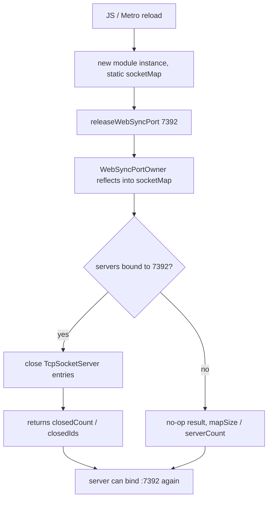

# `pkey-web-access` — Expo Native Module

Expo module that keeps the in-app web sync server (port **7392**) usable across app lifecycle differences on Android and iOS.

## Platform behavior

| Platform | Keep-alive | Port reclaim | Product OS alerts |
|----------|------------|--------------|-------------------|
| **Android** | Sticky **foreground service** (`connectedDevice`). Android requires an ongoing notification while the service runs (`IMPORTANCE_MIN`, silent, short body: LAN web access active in background) | `releaseWebSyncPort(port)` closes orphan `TcpSocketServer` entries after JS/Metro reload | **New browser synced** (`SyncContext` → in-app alert with Block if foreground, auto-dismiss after 10s; else `expo-notifications` channel `pkey-actions` with Block action) |
| **iOS** | `UIBackgroundTask` grace period; screen keep-awake while foregrounded (JS via `expo-keep-awake`). **No** sticky local notification | Stub (empty diagnostics) | Same: **new browser synced** only |
| Expo Go / missing native | No sticky Expo fallback | Patched `TcpSockets.closeServersByPort` path from `syncWebServer.ts` | Still works if OS notifications are available |

iOS **cannot** keep a LAN TCP server alive indefinitely in the background (App Store / OS policy). After the grace period ends, the server may be suspended; when the user returns to the app, `SyncContext` auto-restarts web access if it was still enabled.

## Layout

```text
modules/pkey-web-access/
├── index.ts                              JS bridge (requireNativeModule + helpers)
├── package.json                          name: pkey-web-access
├── expo-module.config.json               apple + android
├── android/.../pkeywebaccess/
│   ├── PkeyWebAccessModule.kt            AsyncFunctions
│   ├── WebAccessForegroundService.kt     START_STICKY FG service (minimal noti)
│   └── WebSyncPortOwner.kt               Closes TcpSocketServer entries on a port
└── ios/
    ├── PkeyWebAccess.podspec
    └── PkeyWebAccessModule.swift         UIBackgroundTask only
```

- Android FG channel: `"pkey_web_access_fg"` / `"PKEY"` (`IMPORTANCE_MIN`)
- Android FG notification ID: **7392**
- Android manifest: `foregroundServiceType="connectedDevice"`
- iOS event `onBackgroundTimeExpiring` when the grace period ends

## Why `releaseWebSyncPort` exists (Android)

`react-native-tcp-socket` stores servers in a native map. After JS reload, a new module instance used to get an empty map while the old `ServerSocket` still held **7392** (`EADDRINUSE`). PKEY patches that library so `socketMap` is **static** (process-wide); `WebSyncPortOwner` reflects into that map and closes servers bound to the given port. See `patches/react-native-tcp-socket+6.4.1.patch`.



## API (JS)

```typescript
export interface WebSyncPortReleaseResult {
  mapSize: number;
  serverCount: number;
  closedCount: number;
  closedIds: number[];
}

export interface PkeyWebAccessModule {
  startForegroundService(title: string, body: string): Promise<void>;
  stopForegroundService(): Promise<void>;
  updateNotification(body: string): Promise<void>; // no-op for product status
  releaseWebSyncPort(port: number): Promise<WebSyncPortReleaseResult>;
}
```

Consumed as `"pkey-web-access": "file:./modules/pkey-web-access"` from the app root. JS orchestration: `src/services/webForegroundService.ts` + `src/context/SyncContext.tsx` (browser-synced OS alert).

## Related

- [MOBILE_APP.md](./MOBILE_APP.md)
- [ARCHITECTURE.md](./ARCHITECTURE.md)
- [WEB_MDNS_VALIDATION.md](./WEB_MDNS_VALIDATION.md)
- Stub: [`modules/pkey-web-access/README.md`](../modules/pkey-web-access/README.md)

mDNS publication stays in `react-native-zeroconf` (`src/services/webDiscovery.ts`) until the [WEB_MDNS_VALIDATION.md](./WEB_MDNS_VALIDATION.md) lab shows that no desktop resolver sees an A/AAAA record. Moving publish into this module (NsdManager / NetService) would not fix Chrome Secure DNS on Windows; keep the numeric Copy address fallback.
