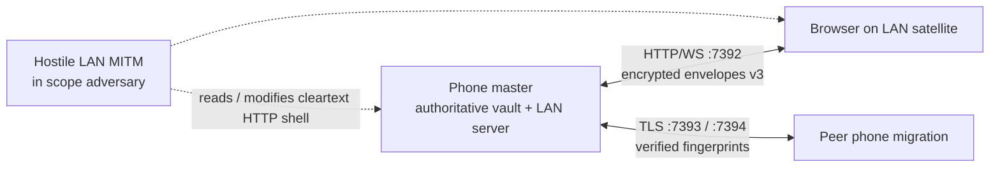

# Threat model

PKEY is local-first: vault ciphertext lives on your devices. There is no vendor cloud for secrets. Optional LAN web access, device migration, HIBP, and favicon lookup are **opt-in** and off by default. A **strict offline** profile disables those channels in one switch.

## Assets

| Asset | Where |
|-------|--------|
| Master password | Ephemeral JS input during unlock only (`masterPasswordVault`) |
| Root key | Native secret holder (`pkey-crypto`) while unlocked; wiped on lock. JS may briefly see plaintext when rendering a secret |
| Biometric unlock bundle | Hardware-bound Keystore/Keychain via `pkey-vault-keys` (user-auth required per use) |
| Encrypted vault file | App documents (`pkey_encrypted_db.json`, envelope v4 / legacy v3) |
| Session / sync tokens | Phone sync server + browser session after unlock |
| Offline web vault | Browser IndexedDB (encrypted envelope) |
| Migration pairing code | Shown on-device during peer transfer |
| Device secret (opt-in) | Non-exportable Keystore/Keychain; recovery kit is the only portable copy |

## Trust boundaries

1. **Phone (master)** — Holds the authoritative vault; runs LAN web access when enabled.
2. **Browser on LAN (satellite)** — Opens the address copied from the phone (`http://….local:7392` when published), unlocks with the same master password (or unlock-on-phone), syncs over WebSocket with end-to-end encrypted envelopes (protocol v3; v2 still accepted during the sunset window).
3. **Peer phone (migration)** — TLS transfer on ports 7393/7394 with user-verified fingerprints.

## Assumptions

- **LAN web access assumes a trusted Wi‑Fi** (home/office you control). Transport to the browser is plain HTTP/WS; confidentiality of vault payloads relies on application-layer encryption and SPAKE2 (protocol v3), not TLS on port 7392. A MITM can still replace the HTML shell; compare the SAS and only open the URL copied from the phone.
- Device migration **does** use TLS between phones; users should compare fingerprints before transfer.
- The master password is never recoverable if lost. With **device secret** enabled, a `.pkey` copy also needs the recovery kit.
- Hermes cannot zeroize JavaScript strings. Lock wipes references and native key handles; residual copies of a revealed secret may remain until GC.

## Adversaries (in scope for design)

| Adversary | Risk | Mitigations |
|-----------|------|-------------|
| Hostile LAN MITM | Can see/modify cleartext HTTP shell and attempt WS tampering | SPAKE2 + AEAD envelopes; 6-digit SAS on phone-unlock; use trusted Wi‑Fi; disable web access / strict offline profile |
| Malware on unlocked phone/PC | Can read unlocked vault / browser session | OS lock, auto-logout, foreground idle lock, screen-capture controls. **Accepted residual:** malware with the unlocked UI |
| Stolen locked phone | Offline vault ciphertext | Argon2id 64 MiB + strong master password policy; optional device secret |
| Root / jailbreak + forensic dump | Extract app files, attempt Keystore/Keychain, memory scrape | Hardware-bound biometric keys; native key holder wipe on lock; backup exclusion; root detection (best-effort, not a boundary) |
| Malicious satellite client | Fake browser on LAN | SPAKE2; blocklist of source ids / IPs in Security tab |
| Malicious backup / USB copy of `.pkey` | Offline KDF attack | Argon2id; device secret makes the file useless without the recovery kit |
| Clipboard / screenshot malware | Harvest a copied or visible secret | 30 s clipboard clear; FLAG_SECURE default on |

Optional **confirm on phone** (`webConfirmOnPhone`): after the PWA is already authenticated, sensitive actions can be approved on the phone with biometrics instead of re-typing the master password in the browser. This is presence-on-phone, not a substitute for login. Default off.

Optional **login with phone** (`webLoginOnPhone`): the PWA login screen can unlock via Face ID on this device after both sides show a matching **6-digit** SAS. Default off. The phone wraps `passwordHash` only after the user compares the codes. A LAN MITM who swaps public keys cannot complete unlock if the user checks the SAS.

## Out of scope (by design)

- Recovering a forgotten master password (or a lost device-secret recovery kit)
- Protecting an **unlocked** device from the person holding it, or from malware that can read the screen / accessibility APIs
- Public installable PWA / omnibox “Install app” (not offered; use a normal browser tab)
- Vendor cloud sync of vault plaintext
- FIPS 140-3 validation of the crypto modules
- Perfect zeroization of JavaScript strings (Hermes)

## Related

- [SECURITY.md](./SECURITY.md) — vulnerability reporting
- [ARCHITECTURE.md](./ARCHITECTURE.md) — encryption and data flow
- [MOBILE_APP.md](./MOBILE_APP.md) — device secret + recovery kit (user help `device_secret`)
- [WEB_CLIENT.md](./WEB_CLIENT.md) — LAN browser vault
