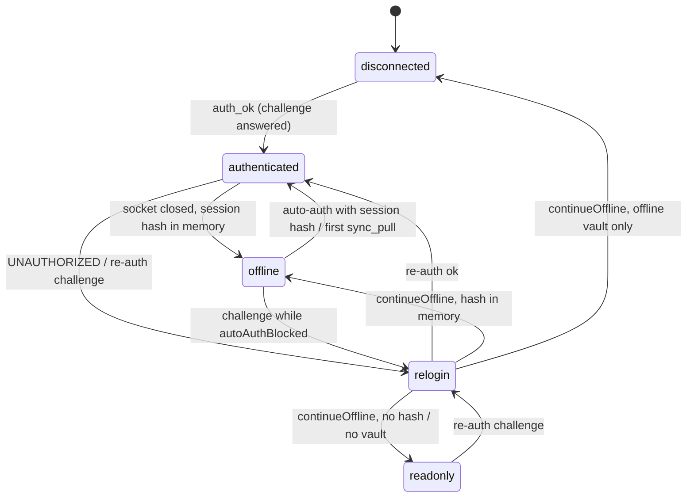
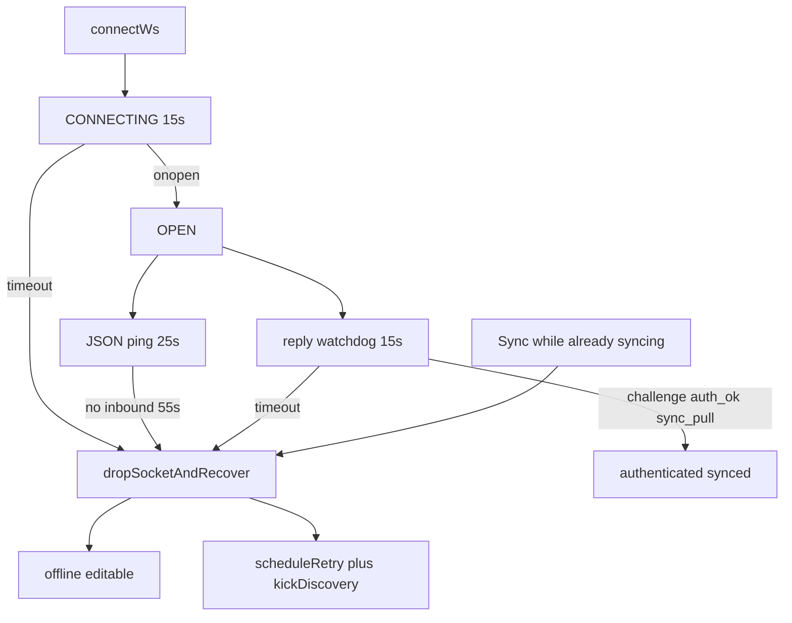
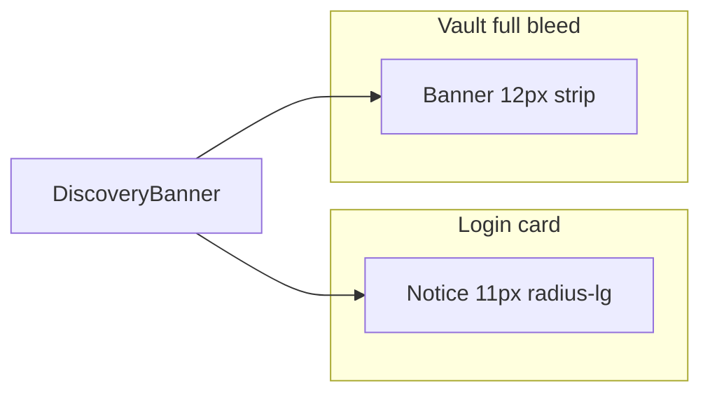
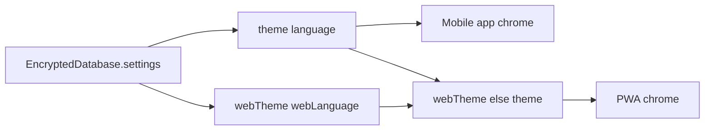
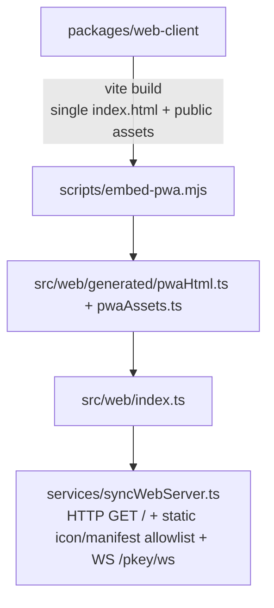

# `@pkey/web-client` — Solid.js LAN web vault

Browser vault UI that connects to a phone running PKEY web access. Built with **Solid.js + Vite**, emitted as a single HTML file, embedded into the mobile app, and served over LAN **HTTP** (port **7392**). Authenticates with SPAKE2 (protocol v3) using the same master-password verifier as the mobile vault; HMAC challenge-response remains for protocol v2. Sync uses `@pkey/core` v3 XChaCha20-Poly1305 envelopes (v2 AES-CBC+HMAC during grace).

Open the address copied from the phone (`http://pkey-….local:7392` when mDNS published, numeric LAN address as fallback) in a normal browser tab. There is no HTTPS certificate flow and no installable / “Add to Home Screen” app flow. The on-device server still serves the HTML shell **and** an allowlist of icons/manifest (`/brand-logo.png`, favicons, `/pwa-*.png`, `/manifest.webmanifest`) so the in-page logo and browser tab icon load.

## Layout

```text
packages/web-client/
├── src/
│   ├── main.tsx           initApp + Solid render
│   ├── App.tsx            Login vs vault routing
│   ├── state/appStore.ts  Solid store, WebSocket client, CRUD
│   ├── components/        VaultScreen, VaultCard, CardModal, Badge, Chip, Banner, Notice, …
│   ├── theme/tokens.ts    CSS variables / dark-light
│   └── util/              Secure input helpers
├── e2e/                   Playwright smoke + a11y
├── dev/mockMaster.ts      Local WS master for development
└── vite.config.ts         solid + vite-plugin-singlefile
```

## Connection model

- WebSocket: `ws://${hostname}:${port}/pkey/ws` (dev: Vite proxy → `localhost:7392`)
- **ConnState:** `'disconnected' | 'connecting' | 'authenticated' | 'offline' | 'readonly' | 'relogin'`
- **SyncStatus:** `'idle' | 'syncing' | 'synced' | 'offline' | 'readonly'`
- **Recovery timeouts** (half-open sockets never fire `onclose`; discovery bails while `CONNECTING`/`OPEN`):
  - Connect: **15s** with no `onopen` → `dropSocketAndRecover`
  - Protocol reply: **15s** after `challenge_request` / `auth` / `sync_push` / `sync_pull_request` with no matching reply
  - JSON ping every **25s**; inbound silence (including missed `pong`) of **55s** while `OPEN`
  - Reconnect delay: exponential backoff with jitter (cap 30s); discovery circuit opens after 3 failed cycles (~90s pause)
  - mDNS probe timeout: **5s**; subnet sweep is RFC1918-only and capped at **8s**
  - Second tap on Sync while already `syncing` force-drops immediately
  - Recover: close the zombie socket, editable offline + outbox, toast `sync_error_watchdog`, `scheduleRetry` + `kickDiscovery`. If the hang was on **login** (no session yet), restore the password form, set `loginError` / toast `auth_timeout`, and do not leave the UI on “Authenticating…” with no input.

Transitions as implemented in `state/appStore.ts` (`connecting` is declared but not assigned at runtime):




- Offline vault helpers can keep an encrypted snapshot in IndexedDB (unlock still needs the master password hash)
- **Identity:** the PWA pins the vault `salt` (generation) plus last host. `deviceId` from `/pkey/meta` is the phone install, not the vault. `/pkey/meta` also advertises a public UUID v4 `sessionId` + `sessionCreatedAt` so login and the vault header can show the same id as Security on the phone. After a new mobile session the browser may still hold the previous vault; incremental sync will not push those cards. Salt mismatch with local cards pauses `flushOutboxAndPull` and sends `vault_fork`. The phone chooses one session: keep the phone (PWA wipes IndexedDB/outbox and pulls), keep the browser (PWA `sync_push` with `replaceVault` so the phone is replaced, not LWW-merged), or decide later (PWA stays offline; a durable defer record blocks outbox flush/persist even if IndexedDB salt was overwritten; the master rejects incremental `sync_push` / pull with `SESSION_MISMATCH` until `use_phone` or `use_pwa`). An empty outbox uses `sync_pull_request` (pull does not write). `server_push` may include `versionHash` + `settingsHash`; matching hashes skip the round trip. Deploy the phone app before refreshing the embedded PWA.
- **Confirm on phone (opt-in):** `AppSettings.webConfirmOnPhone` (Security tab, default off). When the PWA is live-authenticated it sends an enveloped `action_confirm_request` for edit / delete / reveal / copy (XChaCha20-Poly1305 on protocol v3; AES-CBC+HMAC on v2; `requestId` / `action` / `ok` are not on the wire). The phone prompts biometrics (or master password) and replies with an enveloped `action_confirm_result` that echoes `action`+`cardId`. Timeout, deny, HMAC/AEAD failure, or bind mismatch fall back to the browser password modal. Login / re-login still require the master password in the browser. The flag is master-only (a PWA settings push cannot turn it on).
- **Unlock with phone (opt-in):** `AppSettings.webLoginOnPhone` (Security tab and the web-access card, default off). Advertised on `GET /pkey/meta` so the fingerprint button can appear before unlock. Tap sends a plaintext `unlock_request` (ephemeral X25519 pub + nonce). The phone replies `unlock_offer`, both screens show a 6-digit SAS, then Face ID wraps `passwordHash` in `unlock_grant` under HKDF(ECDH). The PWA unwraps and completes SPAKE2 (or HMAC on v2) — it never receives the master password. Compare the SAS; a mismatch means abort and type the password. Old masters that do not know the type fall back to password. Master-only flag.
- **Web session lock** (`settings.webAutoLogout`, default `15M`): 5 min / 15 min / 1 hour / Never. One inactivity clock (`lastActivityAt`) keeps running while the tab is hidden; returning to the tab compares wall-clock (`Date.now()`) because browsers freeze `setTimeout`. Independent of phone `autoLogout`. `NEVER` disables both idle and hidden-tab lock.
- After unlock, a one-shot **StayOpenBanner** asks the user to leave the tab open and come back another day via **Copy address** on the phone. “Save as a favorite” is shown only when `location.hostname` ends with `.local`. HTTPS and a Service Worker on `:7392` are deferred (certificate warnings are worse than Copy address).
- i18n: `@pkey/core` `t` / `langFromSettings` — PWA copy uses `webLanguage ?? language` (ESP/ING; `AUTO` follows the **browser**)
- Theme: `webTheme ?? theme` (`AUTO` follows `prefers-color-scheme` in the browser). Header toggles write only `webTheme` / `webLanguage` so they never overwrite the phone UI. Live settings pushes send that satellite patch only.
- Vault list respects synced `settings.groupCardsByLink` via `groupCardsByLinkKey` + `VaultLinkGroup` (no PWA toggle — change the setting on mobile)
- Vault list is always A–Z for display (`sortCardsForList` title fallback: title → URL → username). Presentation-only — no sort button; persisted / sync arrays are unchanged.

## Compact UI chrome

Status and metadata use four primitives (tokens in `packages/web-client/src/index.css`). Do not add per-screen `font-size` / `border-radius` for these roles.

- **Badge** — 9px filled pill (`border-radius: 999px`) for card type and HIBP. Long HIBP labels ellipsize (`max-width: 14em`). Link-group counts use the same component at 11px (`tone=count`).
- **Chip** — 9px outlined (`--radius-sm`) for user tags (`.tag-chip` kept for e2e).
- **Banner** — 12px full-bleed vault strip (`--banner-fs`). Tones: warning, danger, info. Used for readonly / offline / fork / stay-open / vault discovery / HTTP LAN warning.
- **Notice** — 11px inset callout (`--radius-lg`), matching the old login LAN warning. Used on login for discovery and the LAN disclaimer.
- **StatusLine** / **StatusDot** — 8px disc + 11–12px label; not a chip.

Login discovery is a Notice (not a Banner) so it shares radius and type with the LAN warning. While that chrome is visible, the login `.conn-status` line is hidden so “Looking for the phone…” is not rendered twice.






Use only on trusted local networks — traffic is not TLS-wrapped on the wire (vault payloads remain E2E encrypted with the master password).

## Embed into mobile



```bash
npm run refresh:pwa          # build:web + embed:pwa
npm run prebuild:mobile      # core + web + embed
```

**Dev-client:** after `refresh:pwa`, reload Metro — no APK reinstall. Hard-refresh the browser on `:7392`.

## Local development

```bash
npm run build:core
npm run dev:web
```

Optional mock master: `packages/web-client/dev/mockMaster.ts` for UI without a phone.

## How to test

```bash
npm run test:web
npm run test:e2e
```

## Related

- [ARCHITECTURE.md](./ARCHITECTURE.md)
- [CORE_PACKAGE.md](./CORE_PACKAGE.md)
- Stub: [`packages/web-client/README.md`](../packages/web-client/README.md)
