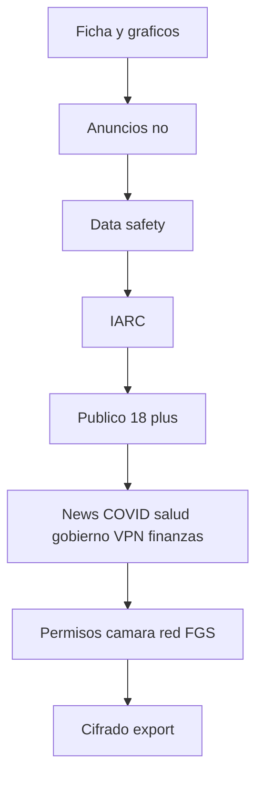

# Play Console — declaraciones (PKEY)

Playbook para rellenar **App content** y Data safety con lo que el código hace hoy. No es el formulario de Google: es la respuesta honesta para copiar. Identidad legal de la cuenta de desarrollador va en Console, no en este archivo.

Fuente de verdad del lanzamiento: [../DEPLOY_CHECKLIST.md](../DEPLOY_CHECKLIST.md). Ficha (título, textos, gráficos): [../store/PLAY_LISTING.md](../store/PLAY_LISTING.md).

Pegar en Console **en este orden**:

1. Crear app **PKEY**, package `com.severaltool.pkey`, gratis.
2. Política: https://severaltool.github.io/pkey/privacy.html — Términos: https://severaltool.github.io/pkey/terms.html
3. Email de soporte (el de la cuenta de desarrollador).
4. Data safety, IARC, público **18+**, ads=no, IAP=no, FGS `connectedDevice`, cifrado/export — respuestas abajo.
5. Subir AAB de EAS production + Play App Signing.
6. Internal testing → Closed → producción staged (10% primero).

Cualquier red nueva (analytics, filtraciones on por defecto, otro CDN) exige **actualizar Data safety antes del siguiente AAB**.

## Ads

| Pregunta | Respuesta |
|----------|-----------|
| ¿La app contiene anuncios? | **No** |

No hay AdMob, Ad ID ni SDKs de publicidad.

## Data safety

Definición de Google: **recoger** = transmitir datos fuera del dispositivo desde la app. Datos que solo viven en el teléfono **no** se declaran como recogidos.

### ¿La app recoge o comparte datos de usuario?

**Sí.** El editor **no** opera un servidor de bóveda. Hay dos salidas **opcionales**, apagadas por defecto, que el usuario puede activar:

1. Iconos de sitio: se envía el **nombre de host** de una tarjeta a servidores ajenos de iconos.
2. Comprobación de filtraciones: se envía un **prefijo de 5 caracteres** del hash SHA-1 de una contraseña (no la contraseña ni el hash completo) a una API pública de prefijos.

### Tipos a declarar (compartidos, no almacenados por el editor)

Añadir **una** fila de *App activity → Other actions* (u “Otras acciones”) con este alcance, o dos filas equivalentes si Console obliga a separarlas.

| Campo | Valor |
|-------|--------|
| Recogido | **No** (el editor no se queda con una copia) |
| Compartido | **Sí** — terceros de iconos y/o API de prefijos de filtraciones |
| Procesado de forma efímera | **Sí** (petición/respuesta; el editor no guarda el host ni el prefijo) |
| Obligatorio u opcional | **Opcional** — ajustes `enableFaviconLookup` y `enableHibpCheck`, ambos `false` de fábrica |
| Fines | Funcionalidad de la app |
| Cifrado en tránsito | **Sí** para esas salidas (HTTPS). No afirmar que *todo* el tráfico de la app es HTTPS: la PWA LAN puede usar HTTP en IPs locales; el canal de sync va cifrado en la aplicación |
| Los usuarios pueden pedir que se borre | **No aplica** de forma útil: el editor no aloja el dato. El usuario desactiva el ajuste o desinstala |

### Tipos que **no** se declaran

| Tipo | Por qué no |
|------|------------|
| Contraseñas / secretos de la bóveda | No se transmiten al editor ni a un servidor de bóveda |
| Ubicación | El SSID se lee en el dispositivo. En Android 13+ el permiso es Wi‑Fi cercano (`neverForLocation`), no GPS. No se envía |
| Identificadores de dispositivo | `deviceId` local para emparejar en LAN; no se envía al editor |
| Biometría | Plantillas en el SO; la app guarda material de desbloqueo en el almacén seguro del dispositivo |
| Fotos / cámara | QR on-device; no se sube el flujo de cámara |
| Anuncios / analítica / crash cloud | No hay SDKs |
| Datos financieros | No se procesan pagos. Guardar un login bancario en la bóveda **no** es una función financiera de la app |

### Preguntas de cierre típicas

| Pregunta | Respuesta |
|----------|-----------|
| ¿Cumplís la política de familias / COPPA como app para niños? | **No** — no dirigida a niños, público 18+, no Families |
| ¿Revisión de seguridad independiente? | **No** (no hay informe de laboratorio en el repo) |
| Cifrado de datos en tránsito (los que se comparten) | Sí, HTTPS en iconos y filtraciones |
| Cifrado de datos en reposo (bóveda) | Sí, en el dispositivo. Envelope v4: Argon2id + XChaCha20-Poly1305. No marcar AES-GCM. |

## IARC / clasificación de contenido

Cuestionario de utilidad / productividad. Respuestas coherentes con el código:

| Tema | Respuesta típica |
|------|------------------|
| Violencia, sangre, armas | No |
| Lenguaje soez | No |
| Contenido sexual | No |
| Drogas / alcohol / tabaco | No |
| Apuestas | No |
| UGC sin moderación | No (bóveda privada del usuario) |
| Ubicación compartida | No |
| Compras / anuncios en la app | No |
| Interacción de usuarios | No (salvo el propio usuario en sus dispositivos / LAN) |
| Datos sensibles del usuario | El usuario puede **guardar** secretos en el dispositivo; la app no los publica |

La clasificación resultante suele ser para todas las edades a nivel IARC. El público objetivo de Console sigue siendo **18+** (app de productividad no *diseñada* para niños; evita Families Policy). Eso **no** es un veto a adolescentes ni un motivo para Restrict Minor Access. No Designed for Families.

## Público objetivo

| Campo | Valor |
|--------|--------|
| Grupo de edad | **18 y más** (audiencia de diseño, no bloqueo de tienda) |
| ¿Dirigida a niños? | **No** |
| Designed for Families | **No** |
| Restrict Minor Access | **No** — Play solo lo exige para apuestas con dinero real, citas/matchmaking y chat anónimo. Un gestor de contraseñas no entra. |
| En la app | Un checkbox al crear sesión: leer y aceptar privacidad y términos. Sin declaración de edad ni fecha de nacimiento. La privacidad usa el umbral COPPA (menores de 13), no un corte de producto a 18. |

## News / COVID / Health / Government / VPN / Finance

| Declaración | Respuesta | Nota |
|-------------|-----------|------|
| App de noticias | No | |
| COVID | No | |
| Salud | No | |
| Gobierno | No | |
| VPN / proxy | **No** | El HTTP LAN en el teléfono **no** es una VPN |
| Funciones financieras | **No** | No hay pagos, wallet ni corretaje. Las tarjetas tipo frase semilla son datos que el usuario guarda |

## Permisos — texto para Console

Pedir cada permiso **en el momento de uso**. Copy de cámara del binario: “PKEY” (no “pkey”).

| Permiso | Cuándo | Propósito a declarar |
|---------|--------|----------------------|
| Cámara | Escaneo QR (migración / emparejamiento / OTP) | Escanear códigos en el dispositivo |
| Notificaciones | Alertas locales (seguridad, clientes LAN) | Avisos en el dispositivo |
| Internet | Enlaces, import, iconos opt-in, filtraciones opt-in | Red opcional; la bóveda no se sube |
| Estado de red / Wi‑Fi / multicast | LAN, mDNS | Descubrir y servir en la red local |
| Ubicación (Android 12 e inferior) | Solo al pulsar “Mostrar nombre de la red” | Leer el SSID **en el dispositivo** |
| Dispositivos Wi‑Fi cercanos (Android 13+) | Igual | Leer el SSID; `neverForLocation` |
| Foreground service + `connectedDevice` | Acceso web LAN activo | Mantener el servidor local `:7392` mientras el usuario usa el navegador en otro equipo de la misma red |
| Autofill (`BIND_AUTOFILL_SERVICE`) | El usuario elige PKEY en el selector del sistema | Rellenar logins **solo Android**. **No** marcar Accessibility API |

No declarar: `QUERY_ALL_PACKAGES`, `DEVICE_ADMIN`, Accessibility, ubicación en segundo plano, `AD_ID`.

## Foreground service (`connectedDevice`)

El binario usa `FOREGROUND_SERVICE_CONNECTED_DEVICE` (`modules/pkey-web-access`). **No cambiar el tipo en código sin probar Android 14+** (un tipo mal declarado tumba el servicio).

Texto para la declaración en Console:

> El servicio en primer plano mantiene un servidor HTTP/WebSocket **en el propio teléfono** para que un navegador en otro dispositivo de la **misma red local** use la bóveda. El teléfono actúa como host de ese cliente de red local. No es Bluetooth/USB; no es una VPN. El usuario lo enciende a propósito; hay notificación persistente de sistema.

Si Play rechaza `connectedDevice`, el plan B es `specialUse` + subtipo en el manifiesto y nueva justificación. No se aplica en este pase.

## Cifrado / exportación (US EAR)

| Pregunta (sentido) | Respuesta |
|--------------------|-----------|
| ¿Usáis cifrado? | **Sí** — más allá de HTTPS: Argon2id + XChaCha20-Poly1305 (bóveda v4), TLS en migración, SPAKE2 en LAN v3 |
| ¿Solo HTTPS de plataforma? | **No** |
| ¿Producto de masa / disponible al público? | **Sí** (app de consumidor en Play) |
| Exención típica | Mass-market / retail encryption (confirmar el texto vigente del formulario) |

No afirmar “cifrado militar”. La bóveda v4 usa XChaCha20-Poly1305, no AES-GCM.

## targetSdk y 16 KB

`app.json` pinea `compileSdkVersion` / `targetSdkVersion` **36** y `useLegacyPackaging: false`. Tras el AAB de producción: Play Console → App bundle explorer → **Memory page size**, y en el repo `npm run check:16kb -- archivo.aab`. Receta: [DEPLOYMENT.md](../DEPLOYMENT.md#store-aab-production). No bajar `targetSdk` si una `.so` falla el chequeo.

## Photos / video (Android 13+)

Solo cámara en vivo para QR. **No** marcar acceso a la biblioteca de fotos/vídeos si el manifiesto no pide `READ_MEDIA_*`.
